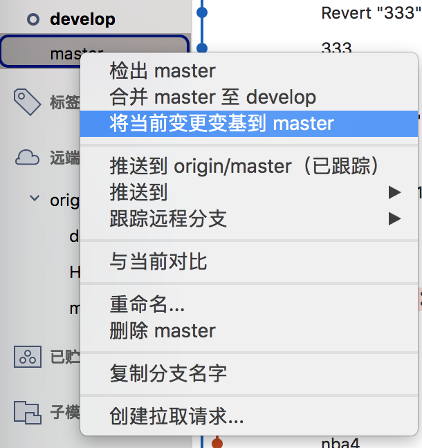

## git 命令
- git config credential.helper store 明文保存 git 密码到电脑
- git clone xxx 克隆项目
- git clone xxx git-practice-another (指定 clone 下来的目录名称)
- git log 提交的历史记录
- git log -p 详细提交记录
- git status 查看工作目录的状态
- git diff add 之前显示将添进暂存区的内容
- git add （可以直接单个文件a.txt，也可以如下批量）
>  git add -A  提交所有变化
> 
>	git add -u  提交被修改(modified)和被删除(deleted)文件，不包括新文件(new)
>
>	git add .  提交新文件(new)和被修改(modified)文件，不包括被删除(deleted)文件

- git diff --staged 再 git commit 前 显示此次提交修改的东西
- git diff HEAD 查看工作目录和上一条 commit 的区别
- git commit -m "xxx"
- git commit (可在 vi 弹窗键入提交信息)
- git push 推送到 origin 下的当前分支
- git push origin feature1 推送本地创建的分支到 origin
- git pull 拉取当前分支
- git pull origin master/develop... 从指定分支拉取更新
- git branch 查看当前分支
- git branch dev/fea 创建分支
- git checkout dev 签出/切换分支
> git checkout -b dev 等同上面两步合并先创建再签出
- git branch -d feature1 如果要删除 HEAD 指向的 branch，需要先用 checkout 把 HEAD 指向其他地方
- git branch -D feature1 某个分支未 merged 到 master 时会失败，但功能砍掉可强制删除
- git merge develop 合并develop 到当前分支
- git gui 解决冲突文件，手动 commit
- git merge --abort 冲突发生，还原到之前版本
- git commit --amend 修正刚才的 commit （未 push 到 origin），产生一条新 commit 替换原来的 commit
- git rebase -i HEAD^^ 交互式变基，修改倒数第二个 commit
> 修正倒数第二个 commit，pick 改成 edit ，再修改文件，git add -A，git commit --amend，git rebase --continue（记住不能修改后面 commit 的文件否则会需要 merge）
- git reset --hard HEAD^1 恢复到上个 commit，直接mouqu，git reset 应该用在私有分支上
- git revert HEAD 恢复到上个 commit，将之前的提交反转（新增就删除，反之），然后做一次提交，git revert 可以用在公共分支上
- git remote show origin 查看远端分支状态
- git remote prune origin 删掉所有在远端都已经不存在的跟踪分支
- git stash 藏匿 
- git stash -u 藏匿包括 untracked 
- git stash pop 取出
- git tag -a v1.01 -m "Relase version 1.01"

## git 关键词
* q 清除窗口
* ahead 领先、超前

## git 常见问题
### config
remote 的 head 在 develop，要在 develop-3.1 做功能开发， clone 。。。another 后，git flow init 是在检出的 head 上进行的 ，请修改 config 的配置文件，develop = develop-v3.1

### 文件的四种状态
* untracked 未跟踪
* modified / unstaged 已修改未暂存
* staged 已暂存 
* commited 已提交

### Head
- HEAD 是指向当前 commit 的引用，它具有唯一性，每个仓库中只有一个 HEAD。在每次提交时它都会自动向前移动到最新的 commit 。
- branch 是一类引用。HEAD 除了直接指向 commit，也可以通过指向某个 branch 来间接指向 commit。当 HEAD 指向一个 branch 时，commit 发生时，HEAD 会带着它所指向的 branch 一起移动。
- push 的时候之后上传当前分支，并不会上传 HEAD；远程仓库的 HEAD 是永远指向默认分支（即 master）的

### merge 
merge 的含义：从两个 commit「分叉」的位置起，把目标 commit 的内容应用到当前 commit（HEAD 所指向的 commit），并生成一个新的 commit；

merge 的适用场景：

- 单独开发的 branch 用完了以后，合并回原先的 branch；
- git pull 的内部自动操作。

### merge 和 rebase 
rebase 是带着当前 commit 移到别的 commit 上「去」，而 merge 则是把别的 commit 合并过「来」。

### git pull 的流程
1. git fetch 下载远端仓库内容时，这两个镜像引用得到了更新，origin/master 和 origin/HEAD 移动到了最新的 commit。
2. git merge origin/HEAD

### git commit 后如何输入提交信息？
弹出 vi 窗口后键入 i 处于 insert 状态，编辑完后按 ESC 保存，再敲打两个 ZZ 完成 commit。

### 意外删除了某个 Branch 的恢复
- git reflog 引用的移动历史
- git checkout 446c256 
- git checkout branch

## SourceTree

### rebase（git rebase master）

### reset

### prune

### 交互式变基

### 交互式变基撤销提交

