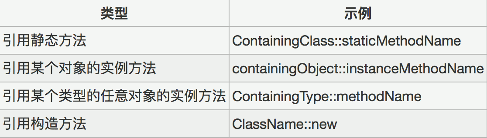
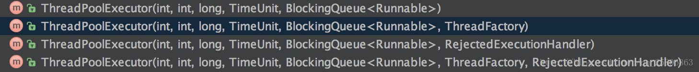

## JDK 新特性 ##

### JDK1.5新特性（2004年10月发布）
1. 泛型
1. foreach
1. 自动拆箱装箱
1. 枚举
1. 静态导入（Static import）
1. 元数据（Metadata）
1. 线程池
1. Java Generics(JDK1.5 中 Collection 类库的大部分类都被改进为 Generic 类)


### JDK1.6新特性（2006年4月发布）
1. Desktop 类和 SystemTray 类
1. 使用 JAXB2 来实现对象与 XML 之间的映射
1. StAX
1. 使用Compiler API
1. 轻量级 Http Server API
1. 插入式注解处理 API(Pluggable Annotation Processing API)
1. 用 Console 开发控制台程序
1. 对脚本语言的支持
1. Common Annotations


### JDK1.7新特性（2011年7月28号发布）
1. 对集合类的语言支持； 
1. 自动资源管理； 
1. 改进的通用实例创建类型推断； 
1. 数字字面量下划线支持； 
1. switch 中使用 String； 
1. 二进制字面量； 
1. 简化可变参数方法调用。

 
### JDK1.8新特性（2014年3月发布）
1. 接口的默认方法
1. Lambda 表达式
1. 函数式接口
1. 方法与构造函数引用
1. Lambda 作用域
1. 访问局部变量
1. 访问对象字段与静态变量
1. 访问接口的默认方法
1. Date API
1. Annotation 注解


### JDK1.9 新特性（2017年9月21号发布）
1. Java 平台级模块系统
1. Linking
1. JShell : 交互式 Java REPL
1. 改进的 Javadoc
1. 集合工厂方法
1. 改进的 Stream API
1. 私有接口方法
1. HTTP/2
1. 多版本兼容 JAR


### 方法引用



## 算法 ##
二分查找
<pre>
//已经排好序的数组
public static int binarySearch(int[] nums, int key) {
    int start = 0;
    int end = nums.length - 1;
    int mid = -1;
    while (start <= end) {
        mid = (start + end) / 2;
        if (nums[mid] == key) {
            return mid;//已经查到返回！
        } else if (nums[mid] > key) {
            end = mid - 1;
        } else if (nums[mid] < key) {
            start = mid + 1;
        }
    }
    return -1;
}
</pre>


冒泡排序 时间复杂度 O(n^2)
<pre>
 public static void bubbleSort(int[] a) {
     int len = a.length;
     for (int i = 1; i < len - 1; i++) {
         for (int j = i; j < len - i; j++) {
             if (a[j + 1] < a[j]) {
                 swap(a, j + 1, j);
             }
         }
     }
 }
</pre>
插入排序、选择排序、快速排序


## 单例五种写法
1. 懒汉式
<pre>
//线程不安全
public class Singleton {
		private static Singleton instance;
    	private Singleton (){}
    	public static Singleton getInstance() {
		 	if (instance == null) {
	   		 	instance = new Singleton();
		 	}
			return instance;
    	}
}
//线程安全，效率低
public class Singleton {
    	private static Singleton instance;
    	private Singleton (){}
    	public static synchronized Singleton getInstance() {
		if (instance == null) {
	   		 instance = new Singleton();
		}
		return instance;
    	}
}
</pre>

2. 恶汉式（推荐，不是多个类加载器环境下实现线程安全）
<pre>
public class Singleton {
    	private static Singleton instance = new Singleton();
   	 	private Singleton (){}
    	public static Singleton getInstance() {
			return instance;
    	}
}
</pre>

3. 双重校验锁
<pre>
public class Singleton {
    	private volatile static Singleton singleton;
    	private Singleton (){}
    	public static Singleton getSingleton() {
		if (singleton == null) {
	    	synchronized (Singleton.class) {
				if (singleton == null) {
		    		singleton = new Singleton();
				}
	    	}
		}
		return singleton;
    	}
}
</pre>

4. 枚举
<pre>
public enum Singleton {
    INSTANCE;
    public void whateverMethod() {
    }
}
</pre>

5. 静态内部类（推荐，lazy loading，线程安全）
<pre>
public class Singleton {
    private static class SingletonHolder {
	 	private static final Singleton INSTANCE = new Singleton();
    }
    private Singleton (){}
    public static final Singleton getInstance() {
		return SingletonHolder.INSTANCE;
    }
}
</pre>


## Java for 循环和 foreach 循环的性能比较
- 需要循环数组结构的数据时，建议使用普通 for 循环，因为 for 循环采用下标访问，对于数组结构的数据来说，采用下标访问比较好。
- 需要循环链表结构的数据时，一定不要使用普通 for 循环，这种做法很糟糕，数据量大的时候有可能会导致系统崩溃。
- ArrayList 用 for 循环，LinkedList 用 foreach 循环。


## Java 的值传递 ##
- “在 Java 里面参数传递都是按值传递”：按值传递是传递的值的拷贝，按引用传递其实传递的是引用的地址值，所以统称按值传递。

- 简单的说，基本类型是按值传递的，方法的实参是一个原值的复本。类对象是按对象的引用地址（内存地址）传递地址的值，那么在方法内对这个对象进行修改是会直接反应在原对象上的（或者说这两个引用指向同一内存地址）。不过要注意  String 这个类型，String 的对象是不可修改 final 的，如果真正要达到改变字符串的效果，我们需要使用  StringBuilder 来替代 String。


## 面向对象设计的六大原则 ##
- 单一职责原则（类的设计原则）
> 类应该是一组“高度相关”的数据和操作的集合（高内聚）

- 开闭原则（如何保证版本修改和迭代的安全性）
> 对扩展是开放的，对修改是关闭的（新的需求和业务要通过接口和代码的新建实现，不允许修改老的接口和代码）

- 里氏替换原则（如何实现灵活的系统架构）
> 利用接口编程的思想，构建扩展灵活的系统架构

- 依赖倒置原则（面向接口编程）
> 模块间的依赖通过抽象实现，具体的实现类之间不能够相互的依赖。

- 接口隔离原则（接口的设计原则）
> 接口的功能尽量内聚和单一，以便可以灵活的复用接口，减少无用的方法暴露

- 迪米特原则（最少知识原则）
> 低耦合，一个类应该尽量只与自己有直接密切关系的类发生关系。


## 异常 ##
按照异常需要处理的时机分为编译时异常也叫 CheckedException 和运行时异常也叫 RuntimeException。只有 Java 语言提供了 Checked 异常，Java 认为 Checked 异常都是可以被处理的异常，所以 Java 程序必须显式处理 Checked 异常。如果程序没有处理 Checked 异常，该程序在编译时就会发生错误无法编译。

常见RutimeException

- NullPointerException
- IndexOutOfBoundsException
- ClassCastException
- ClassNotFoundException 
- IllegalArgumentException


### Error 和 Exception 的区别 ###
Error 类和 Exception 类的父类都是 Throwable 类，他们的区别是：

- Error 类一般是指与虚拟机相关的问题，如系统崩溃，虚拟机错误，内存空间不足，方法调用栈溢等。对于这类错误导致的应用程序中断，仅靠程序本身无法恢复和和预防，遇到这样的错误，建议让程序终止。
- Exception 类表示程序可以处理的异常，可以捕获且可能恢复。遇到这类异常，应该尽可能处理异常，使程序恢复运行，而不应该随意终止异常。


## SQL ##
### 事务四大特征 ###

- 原子性（Atomicity）
> 原子性是指事务包含的所有操作要么全部成功，要么全部失败回滚。

- 一致性（Consistency）
> 一个事务执行之前和执行之后都必须处于一致性状态。

- 隔离性（Isolation）
> 隔离性意味着事务必须在不干扰其他进程或事务的前提下独立执行。

- 持久性（Durability）
> 久性是指一个事务一旦被提交了，那么对数据库中的数据的改变就是永久性的，即便是在数据库系统遇到故障的情况下也不会丢失提交事务的操作。


## 集合框架 ##


- Collection 是 List、Set 等集合高度抽象出来的接口，它包含了这些集合的基本操作。
- List 接口通常表示一个列表（数组、队列、链表、栈等），其中的元素可以重复，常用实现类为 ArrayList 和   LinkedList，不常用的 Vector。另外，LinkedList 还是实现了 Queue 接口，因此也可以作为队列使用。
- ArrayList 是基于数组实现的，是一个动态数组，其容量能自动增长，类似于 C 语言中的动态申请内存，动态增长内存。可以通过下标索引直接查找到指定位置的元素，因此查找效率高，但每次插入或删除元素，就要大量地移动元素，插入删除元素的效率低。
- Set 接口通常表示一个集合，其中的元素不允许重复（通过 hashcode() 和 equals() 判断），常用实现类有 HashSet 和 TreeSet，HashSet 是通过 Map 中的 HashMap 实现的，而 TreeSet 是通过 Map 中的 TreeMap 实现的。另外，TreeSet 还实现了 SortedSet 接口，因此是有序的集合（集合中的元素要实现 Comparable 接口，并覆写 compareto()）。
- Map 是一个映射接口，其中的每个元素都是一个 <Key,Value> 键值对，不常用的 HashTable 直接继承 Dictionary 并实现了 Map 接口.
- Iterator 是遍历集合的迭代器（不能遍历 Map，只用来遍历 Collection），Collection 的实现类都实现了 iterator()，ListIterator 则专门用来遍历 List。
- Arrays 和 Collections 是用来操作数组、集合的两个工具类，例如在 ArrayList 和 Vector 中大量调用了 Arrays.Copyof()，而 Collections 中有很多静态方法可以返回各集合类的 synchronized 版本，即线程安全的版本，当然了，如果要用线程安全的结合类，首选 Concurrent 并发包下的对应的集合类。

### Hash 碰撞
我们知道，判断哈希表中对象的不同是依据 equals() 和 hashCode() 两个方法，那么 hashCode() 的作用就是保证对象返回唯一 hash 值，但当两个对象计算值一样时，这就发生了碰撞冲突。

## 多线程 ##

### 多线程有几种实现方法 ###
- 继承 Thread 类
- 实现 Runnable 接口
- 实现 Callable 接口（FutureTask 实现有返回结果的多线程，get(）获取返回值会阻塞线程）
- 将 Runnable 对象或 Callable 对象 submit 提交给 ExecutorService，返回 Feture 对象，get(）获取返回值会阻塞线程

### Runnable 和 Callable 的区别 ###
Runnable 和 Callable 都可以开启多线程任务。Runnable 从 JDK1.0 开始就有了，Callable 是在 JDK1.5 增加的，它们的主要区别是 Callable 的 call() 可以返回值和抛出异常，而 Runnable 的 run() 没有这些功能，Callable 可以返回装载有计算结果的 Future 对象。

### 简述 synchronized 和 Lock 的区别 ###
- 主要相同点：Lock 能完成 synchronized 实现的所有功能
- 主要不同点：Lock 有比 synchronized 更精确的线程语义和更好的性能。synchronized 会自动释放锁，而 Lock  要求手工释放，并且必须在 finally 从句中释放。

### wait 和 sleep 的区别 ###


wait() 通常被用于线程间交互，sleep() 通常被用于暂停执行。


### sleep() 和 yield() 的区别 ###
1. sleep() 给其他线程运行机会时不考虑线程的优先级，因此会给低优先级的线程以运行的机会；yield()方法只会给相同优先级或更高优先级的线程以运行的机会；
1. 执行 sleep() 后转入阻塞（blocked）状态，而执行 yield() 后转入就绪（ready）状态；
1. sleep() 声明抛出 InterruptedException，而 yield() 没有声明任何异常；
1. sleep() 比 yield()（跟操作系统 CPU 调度相关）具有更好的可移植性。


### 简述 Java 中为什么会出现死锁 ###
当两个线程相互等待对方释放同步监视器时就会发生死锁，Java 虚拟机没有监测也没有采取措施来处理死锁情况，所以多线程编程时应该采取措施避免死锁出现。一旦出现死锁，整个程序既不会发生任何异常，也不会给出任何提示，只是所有线程处于阻塞状态，无法继续。

### synchronized 和 volatile 的区别 ###
volatile 是轻量级的 synchronized，一旦一个共享变量（类的成员变量、类的静态成员变量）被 volatile 修饰之后，那么就具备了两层语义：

1. 保证了不同线程对这个变量进行操作时的可见性，即一个线程修改了这个变量的值，这新值对其他线程来说是立即可见的。
1. 禁止进行指令重排序。

volatile 本质是在告诉 jvm 当前变量在寄存器（工作内存）中的值是不确定的，需要从主存中读取；
synchronized 则是锁定当前变量，只有当前线程可以访问该变量，其他线程被阻塞住。

- volatile 仅能使用在变量级别；synchronized 则可以使用在变量、方法、类、代码块
- volatile 仅能实现变量的修改可见性，并不能保证原子性；synchronized 则可以保证变量的修改可见性和原子性
- volatile 不会造成线程的阻塞；synchronized 可能会造成线程的阻塞。
- volatile 标记的变量不会被编译器优化；synchronized 标记的变量可以被编译器优化
- volatile 最适用一个线程写，多个线程读的场合。

### TheadLocal ###
- ThreadLocal 主要用来提供线程局部变量，也就是变量只对当前线程可见。
- ThreadLocal 是用来维护线程中的变量不被其他线程干扰而出现的一个结构，内部包含一个静态内部类ThreadLocalMap，该类为 Thread 类的一个局部变量，该 Map 存储的 key 为 ThreadLocal 对象自身，value 为我们要存储的对象，这样一来，在不同线程中，持有的其实都是当前线程的变量副本，与其他线程完全隔离，以此来保证线程执行过程中不受其他线程的影响。
- 最常见的 ThreadLocal 使用场景为用来解决数据库连接、Session 管理等。

```
private static ThreadLocal <Connection> connectionHolder = new ThreadLocal<Connection>() {
    public Connection initialValue() {
        return DriverManager.getConnection(DB_URL);
    }
};

public static Connection getConnection() {
    return connectionHolder.get();
}

private static final ThreadLocal threadSession = new ThreadLocal();
public static Session getSession() throws InfrastructureException {
    Session s = (Session) threadSession.get();
    try {
        if (s == null) {
            s = getSessionFactory().openSession();
            threadSession.set(s);
        }
    } catch (HibernateException ex) {
        throw new InfrastructureException(ex);
    }
    return s;
}

```

### 多线程访问共享变量 ###
1. 进行同步控制 synchronized，效率降低，并发变同步(串行)。
1. 使用 ThreadLocal，每个线程持有该变量的的一个副本(各不相干)。

概括起来说，对于多线程资源共享的问题，同步机制采用了“以时间换空间”的方式，而 ThreadLocal 采用了“以空间换时间”的方式。前者仅提供一份变量，让不同的线程排队访问，而后者为每一个线程都提供了一份变量，因此可以同时访问而互不影响。Synchronized 用于线程间的数据共享，而 ThreadLocal 则用于线程间的数据隔离。

### 线程池的作用 ###
提供了对线程的复用，减少重复创建线程的内存和 CPU 消耗，当线程池里没有可复用线程时会新建线程，当线程池里存在大量空闲线程时会回收线程，节约内存。

### 线程池的使用策略 ###
1. 如果线程池中线程数量未达到核心线程的数量，那么会直接开启一个核心线程来执行任务
1. 如果线程池中的线程数量已经到达或者超过核心线程的数量，那么任务会被插入任务队列中排队等待执行
1. 如果任务队列已满，这个时候，如果线程数量未到达线程池规定的最大值，那么会开启一个非核心线程来执行

### ThreadPoolExecutor
ThreadPoolExecutor 是线程池的真正实现，他通过构造方法的一系列参数，来构成不同配置的线程池。ThreadPoolExecutor 被初始化好之后便可以提交线程任务，线程的提交方法主要是 execute 和 submit。



```
ThreadPoolExecutor(int corePoolSize,
                        int maximumPoolSize,
                        long keepAliveTime,
                        TimeUnit unit,
                        BlockingQueue<Runnable> workQueue,
                        ThreadFactory threadFactory,
                        RejectedExecutionHandler handler)
```  
       
                                      
* corePoolSize
> 核心线程数，默认情况下核心线程会一直存活，即使处于闲置状态也不会受存 keepAliveTime 限制。除非将 allowCoreThreadTimeOut 设置为  true。

* maximumPoolSize
> 线程池所能容纳的最大线程数，超过这个数的线程将被阻塞。那么如果设置的 corePoolSize 参数和设置的 maximumPoolSize 参数一致时，线程池在任何情况下都不会回收空闲线程。keepAliveTime 和 timeUnit 也就失去了意义。

* keepAliveTime
> 非核心线程的闲置超时时间，超过这个时间就会被回收。

* unit
> 指定 keepAliveTime 的单位，如TimeUnit.SECONDS。

* workQueue
> 线程池中的任务队列，常用的有三种队列。

* threadFactory
> 线程工厂，提供创建新线程的功能。ThreadFactory 是一个接口，只有一个方法
```
public interface ThreadFactory {
  Thread newThread(Runnable r);
}
```

* RejectedExecutionHandler
>（饱和策略）：当队列和线程池都满了，说明线程池处于饱和状态，那么必须采取一种策略处理提交的新任务。这个策略默认情况下是 AbortPolicy，表示无法处理新任务时抛出异常。

#### workQueue
- SynchronousQueue

> 这个队列接收到任务的时候，会直接提交给线程处理，而不保留它，如果所有线程都在工作怎么办？那就新建一个线程来处理这个任务！所以为了保证不出现<线程数达到了 maximumPoolSize 而不能新建线程>的错误，使用这个类型队列的时候，maximumPoolSize 一般指定成 Integer.MAX_VALUE，即无限大。

- LinkedBlockingQueue

> 这个队列接收到任务的时候，如果当前线程数小于核心线程数，则新建线程(核心线程)处理任务；如果当前线程数等于核心线程数，则进入队列等待。由于这个队列没有最大值限制，即所有超过核心线程数的任务都将被添加到队列中，这也就导致了 maximumPoolSize 的设定失效，因为总线程数永远不会超过 corePoolSize。

- ArrayBlockingQueue

> 可以限定队列的长度，接收到任务的时候，如果没有达到 corePoolSize 的值，则新建线程(核心线程)执行任务，如果达到了，则入队等候，如果队列已满，则新建线程(非核心线程)执行任务，又如果总线程数到了 maximumPoolSize，并且队列也满了，则发生错误。

- DelayQueue

> 队列内元素必须实现 Delayed 接口，这就意味着你传进去的任务必须先实现 Delayed 接口。这个队列接收到任务时，首先先入队，只有达到了指定的延时时间，才会执行任务

 
### 线程池分类 ###
- newCachedThreadPool 创建一个可缓存线程池，如果线程池长度超过处理需要，可灵活回收空闲线程，若无可回收，则新建线程。

	```
	public static ExecutorService newCachedThreadPool() {
        return new ThreadPoolExecutor(0, Integer.MAX_VALUE,
                                      60L, TimeUnit.SECONDS,
                                      new SynchronousQueue<Runnable>());
    }  
    
    1.这种线程池内部没有核心线程，线程的数量是有没限制的。
	2.在创建任务时，若有空闲的线程时则复用空闲的线程，若没有则新建线程。
	3.没有工作的线程（闲置状态）在超过了60S还不做事，就会销毁。
      
	```
- newFixedThreadPool 创建一个定长线程池，可控制线程最大并发数，超出的线程会在队列中等待；定长线程池的大小通常根据系统资源进行设置：Runtime.getRuntime().availableProcessors()

	```
  public static ExecutorService newFixedThreadPool(int nThreads) {
        return new ThreadPoolExecutor(nThreads, nThreads,
                                      0L, TimeUnit.MILLISECONDS,
                                      new LinkedBlockingQueue<Runnable>());
    }
    
    1.该线程池的最大线程数等于核心线程数，所以在默认情况下，该线程池的线程不会因为闲置状态超时而被销毁。
	2.如果当前线程数小于核心线程数，并且也有闲置线程的时候提交了任务，这时也不会去复用之前的闲置线程，会创建新的线程去执行任务。
	3.如果当前执行任务数大于了核心线程数，大于的部分就会进入队列等待，等着有闲置的线程来执行这个任务。
    ```
- newScheduledThreadPool 创建一个定长线程池，支持定时及周期性任务执行。

	```
	 public ScheduledThreadPoolExecutor(int corePoolSize) {
        super(corePoolSize, Integer.MAX_VALUE,
              DEFAULT_KEEPALIVE_MILLIS, MILLISECONDS,
              new DelayedWorkQueue());
    }
    
    //DEFAULT_KEEPALIVE_MILLIS 就是默认10L，这里就是10秒。这个线程池有点像是吧 CachedThreadPool 和FixedThreadPool 结合了一下
    
    1.不仅设置了核心线程数，最大线程数也是 Integer.MAX_VALUE。
	2.这个线程池是上述4个中为唯一个有延迟执行和周期执行任务的线程池。
	```
- newSingleThreadExecutor 

	```
	public static ExecutorService newSingleThreadExecutor(ThreadFactory threadFactory) {
        return new FinalizableDelegatedExecutorService
            (new ThreadPoolExecutor(1, 1,
                                    0L, TimeUnit.MILLISECONDS,
                                    new LinkedBlockingQueue<Runnable>(),
                                    threadFactory));
    }
    
    1.有且仅有一个工作线程执行任务
	2.所有任务按照指定顺序执行，即遵循队列的入队出队 FIFO 规则
	```


## 泛型 ##
泛型，即“参数化类型”。一提到参数，最熟悉的就是定义方法时有形参，然后调用此方法时传递实参。那么参数化类型怎么理解呢？顾名思义，就是将类型由原来的具体的类型参数化，类似于方法中的变量参数，此时类型也定义成参数形式（可以称之为类型形参），然后在使用/调用时传入具体的类型（类型实参）

类型通配符一般是使用 ? 代替具体的类型实参。类型通配符上限通过形如 Box<? extends Student> 形式定义，相对应的，类型通配符下限为 Box<? super Number> 形式


## 反射 ##
所谓的反射机制就是 Java 语言在运行时拥有一项自观的能力，可用于获取对象元信息。Java 的反射机制的实现要借助于4个类：Class，Constructor，Field，Method。（Android 中尽量少用反射，会有性能开销。）

反射调用一般分为3个步骤：

- 得到要调用类的 Class
- 得到要调用的类中的 Method
- Method 调用 invoke()

    Class cls = Class.forName("chb.test.reflect.Student");  
    Method m = cls.getDeclaredMethod("hi",new Class[]{int.class,String.class});  
    m.invoke(cls.newInstance(),20,"chb"); 


## 动态代理 ##
动态代理是设计模式当中代理模式的一种，主要用来做方法的增强，让你可以在不修改源码的情况下，增强一些方法，在方法执行前后做任何你想做的事情（甚至根本不去执行这个方法），因为在 InvocationHandler 的 invoke() 中，你可以直接获取正在调用方法对应的 Method 对象。

具体应用的话，比如可以添加调用日志，做事务控制等。代售点买火车票、翻墙都是代理模式。

- 静态代理：代理类是在编译时就实现好的。也就是说 Java 编译完成后代理类是一个实际的 class 文件。
- 动态代理：代理类是在运行时生成的。也就是说 Java 编译完之后并没有实际的 class 文件，而是在运行时动态生成的类字节码，并加载到 JVM 中。（一个委托类对应一个静态代理，假如有几百个呢，这时就体现动态代理的作用了。）

### 动态代理的实现步骤

- 定义一个委托类和公共接口
- 定义调用处理器类，即实现 InvocationHandler 接口，代理类调用任何方法都会经过这个调用处理器类的 invoke()
- 调用 Proxy.newProxyInstance(impl.getClass().getClassLoader(), impl.getClass().getInterfaces(), handler) 把 handler 和代理类相关联 


## ClassLoader ##


### 双亲委托机制（双亲委派模型)

1. 当 AppClassLoader 加载一个 Class 时，它首先不会自己去尝试加载这个类，而是把类加载请求委派给父类加载器 ExtClassLoader 去完成。
1. 当 ExtClassLoader 加载一个 Class 时，它首先也不会自己去尝试加载这个类，而是把类加载请求委派给BootStrapClassLoader 去完成。
1. 如果 BootStrapClassLoader 加载失败（例如在 $JAVA_HOME$/jre/lib 里未查找到该 Class），会使用ExtClassLoader 来尝试加载；
1. 若 ExtClassLoader 也加载失败，则会使用 AppClassLoader 来加载，如果 AppClassLoader 也加载失败，则会报出异常 ClassNotFoundException。

除了启动类加载器以外，每个类加载器拥有一个父类加载器，用户的自定义类加载器的父类是 AppClassLoader；双亲委派模型可以保证全限名指定的类，只被加载一次；双亲委派模型不具有强制性约束，是 Java 设计者推荐的类加载器实现方式。

### 双亲委托机制的好处
1. 实现类加载的共享功能，提升类加载的效率。
1. 实现类加载的隔离功能，提升系统的安全性。比如，通过这种方式，系统的 String 类只能由系统的 ClassLoader 加载。


## JVM ##


- 类加载器子系统的核心-- ClassLoader 负责将 Class 字节码加载到虚拟机内存中
- 虚拟机的内存按照逻辑划分为4大部分
- 垃圾收集器 GC 负责回收对象
- 本地方法库提供了 Native 方法，比如 C/C++
- 其余的都是跟 CPU 等硬件打交道的，我们了解一下即可


### 内存分配策略、模型 ###
- 静态存储区（方法区）：存储被虚拟机加载的类信息、常量、静态变量、编译器即时编译后的数据。这块内存在程序编译时就已经分配好，并且在程序整个运行期间都存在。
- 栈区：局部变量的基本数据类型和引用存储于栈中，引用的对象实体存储于堆中。它们属于方法中的变量，生命周期随方法而结束。栈内存分配运算内置于处理器的指令集中，效率很高，但是分配的内存容量有限。
- 堆区：又称动态内存分配，成员变量全部存储于堆中（包括基本数据类型，引用和引用的对象实体），它们属于类，类对象终究是要被 new 出来使用的。


### 垃圾回收 

### 四大引用类型 ###
- 强引用（Strong Ref）：强可达，去掉强可达，才会被回收。 
- 软引用（Soft Ref）：内存够用，就保持，内存吃紧，则回收，主要用来做缓存。 
- 弱引用（Weak Ref）：比 Soft Ref 弱，即使内存不吃紧也会被回收。 
- 虚引用（Phantom Ref）：不会在内存保持任何对象。


### 垃圾收集算法 ###
- 引用计数法：被引用1次，计数器加1，没有被引用的时候，则回收。但是引用计数法无法解决对象之前相互引用的问题，因此已经废弃。
- 可达性算法（根搜索算法）：通过 GC 从 ROOT 对象开始搜索，不可达的对象则回收。这时候可以提到引用的类型，主要用得最多就是强引用和弱引用，当存在强引用的时候，内存不足宁愿抛出 OOM 也不会回收，但是是弱引用的话，就有可能会被回收，这样就防止了内存泄漏。

搜索完了就回收

### 垃圾回收算法 ###
- 标记-清除算法：搜索，发现没有引用的对象，直接回收，但是会导致内存碎片过多。
- 复制算法：搜索，扫描没有引用的对象。开辟新的内存空间，将存活的对象复制到新的内存，旧的内存直接清除。由于需要多次交换内存空间，因此在对象数量比较少的时候效率比较高。
- 标记-整理算法：在标记-清除算法的基础上，清除掉不存活的对象之后，把后面的存活对象搬移过来，似的内存连续，解决了内存碎片的问题。
- 分代收集：分代收集是根据对象的存活时间把内存分为年轻和年老代，根据各个代中对象的存活特点，每个代采用不同的垃圾回收算法。新生代采用复制算法，老年代采用标记—整理算法。

### 垃圾回收机制
Java 垃圾回收机制最基本的做法是分代回收，分别为年轻代、年老代、永久代。 

- 年轻代（Young Generation）：绝大多数的 Java 对象会在年轻代被分配，也会在年轻代被回收，回收速度也相对较快。 
- 年老代（Old Generation）：在年轻代长期存在没有被回收的 Java 对象会转移到年老代，这个堆空间通常会被比年轻代的堆空间要大。 
- 永久代（Permanent Generation）：存放 VM 和 Java 类的元数据，以及字符串池和类的静态变量，在 Java8 中，使用 JVM 进程原生内存空间的 Metaspace 代替了永久代(移除永久代了)，原本放在永久代的移到 Heap 中，在默认情况下，Metaspace 将使用 JVM 进程所有可用的内存。


### 触发垃圾回收 ###
Java 会使用有向图的方法进行管理内存，实时监控对象是否可以达到，如果不可到达，则就将其回收，这样也可以消除引用循环的问题。（具体是使用内存占申请内存75%的时候，就启动回收线程）

- 当年轻代或者年老代满了，Java 虚拟机无法为新的对象分配内存空间了
- 手动调用 System.gc() 方法，通常这样会触发一次的 Full GC 以及至少一次的 Minor GC，但是并不会导致 GC 马上执行，反而会增加了虚拟机的负担，因此不推荐直接使用
- 程序运行的时候有一条低优先级的 GC 线程，它是一条守护线程，当这条线程处于运行状态的时候，自然就触发了一次GC了。


### DVM 
- JVM 执行的是 class 文件，DVM 执行的是 dex 文件
- 类加载系统与 JVM 区别比较大
- 可以同时存在多个 DVM
- JVM 是基于栈的，DVM 是基于寄存器的，寻址速度更加快

### ART ###
ART 虚拟机是 DVM 的进化版本：

- 运行的时候，DVM 采用 JIT 来将字节码转换成机器码，效率比较低
- ART 采用了 AOT 预编译技术，APP 安装的时候就完成了字节码转换为机器码，执行速度更加快，效率高
- 但是 ART 会占用更多的安装时间以及存储空间，这是典型的以空间换时间的策略


## TCP 三次握手过程
- 第一次握手

> 建立连接时，客户端发送 SYN 包(syn=j)到服务器，并进入 SYN_SEND 状态，等待服务器确认； 
SYN：同步序列编号(Synchronize Sequence Numbers)

- 第二次握手

> 服务器收到 SYN 包，必须确认客户的 SYN（ack=j+1），同时自己也发送一个 SYN 包（syn=k）,即 SYN+ACK 包，此时服务器进入 SYN_RECV 状态； 

- 第三次握手

> 客户端收到服务器的 SYN＋ACK 包，向服务器发送确认包 ACK(ack=k+1)，此包发送完毕，客户端和服务器进入ESTABLISHED 状态，完成三次握手。