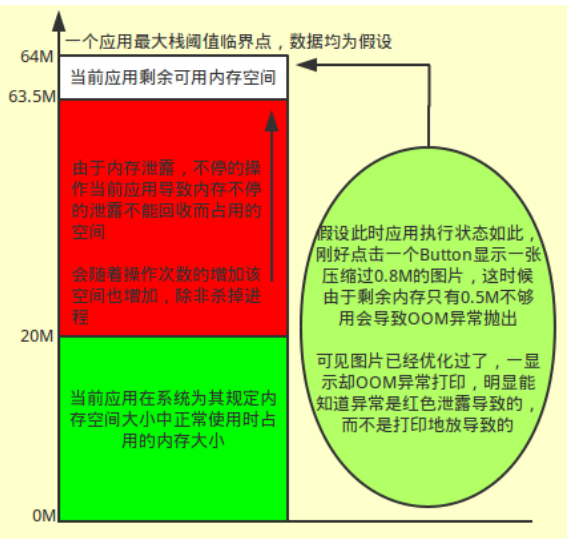
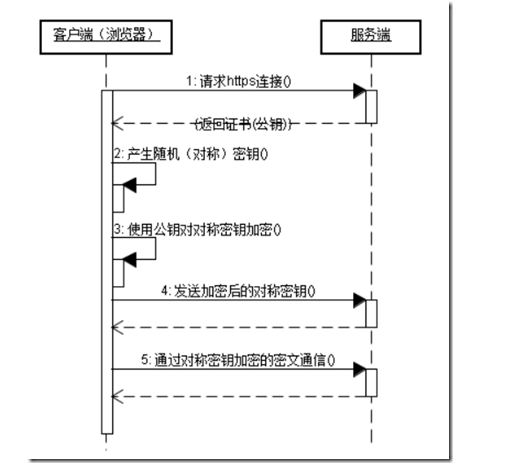

## Android的系统架构 ##


HAL 的全称是硬件抽象层，这样厂商可以以封闭源代码形式提供硬件驱动模块。这一层把接口定义好了，不同的厂商可以提供不同的硬件和不同的驱动，层与层之间就隔离。正因为有这一层的抽象，一个 Android 系统可以适配好多个厂商。


### 谈谈Android的优点和不足之处 ###

优点：

1. 开放性，开源，免费，可定制
1. 挣脱运营商束缚
1. 丰富的硬件选择
1. 不受任何限制的开发商
1. 无缝结合的 Google 应用

缺点：

1. 安全问题、隐私问题
1. 同质化严重
1. 运营商对 Android 手机仍然有影响
1. 山寨化严重
1. 过分依赖开发商，缺乏标准配置

### Android L 5 ###
1. Material Design（定义材料设计规范，扁平化的设计理念）
2. 支持多种设备
3. 支持64位 ART 虚拟机（放弃 Dalvik 虚拟机，改用了 ART 模式，实现了真正的跨平台编译）

### Android M 6 ###
1. 动态权限管理（将危险权限的获取从安装时权限(Install Time Permission)模型移动到运行时权限模型（Runtime Permissions））
2. 指纹识别
3. APP 关联（App Links）
4. Android pay（Android 支付统一标准）
5. 电源管理

#### 6.0 动态申请权限
危险权限

1. CALENDAR
1. CAMERA
1. CONTACTS
1. LOCATION
1. PHONE
1. SENSORS
1. SMS
1. STORAGE

特殊权限

1. SYSTEM_ALERT_WINDOW，设置悬浮窗，进行一些黑科技
1. WRITE_SETTINGS 修改系统设置

API

1. int checkSelfPermission(String permission) 用来检测应用是否已经具有权限
1. void requestPermissions(String[] permissions, int requestCode) 进行请求单个或多个权限
1. void onRequestPermissionsResult(int requestCode, String[] permissions, int[] grantResults) 用户对请求作出响应后的回调
1. shouldShowRequestPermissionRationale（）权限的解释

### Android N 7 ###
1. 分屏多任务
2. 新通知消息（新消息快捷回复、通知消息归拢）
3. 夜间模式
4. 取消支持 Apache HTTP 客户端
5. 在应用件共享文件（使用 FileProvider）
6. 系统级电话黑名单功能

#### Android Scheme V2 签名
- 新的签名机制有更高的安全性（对整个 apk 文件进行 hash 校验，无法修改 apk 信息），安装速度也更加高效（无需解析校验单个文件，v1 需要单个文件校验 hash）。

- 因为 V2 与 V1 不同，是基于整个 APK 的二进制文件内容做签名。所以，不能在签名后再对 APK 做一些操作。 比如 V1 签名后，可以对 APK 做 ZipAlign 操作，可以通过添加空文件的形式做渠道标记。 使用 V2 签名后不能在签名后做类似操作。


### Android O 8 ###
- 画中画 (Picture in picture)
- 自动填写（Auto-Fill）
- 免安装应用 (Instant Apps)
- Google Play 保护机制 (Google Play Protect) 
- 自适应图标
- 增加了字体的支持
- Notification Dots 未读通知显示在 APP 图标，长按展示
- 智能文本选择（Smart Text Selection）


### Support包
google 提供了 Support 系列的包来保证来高版本	sdk 开发的向下兼容性，确保低版本可以使用高版本的某些特性。

* Android Support v4:  这个包是为了兼容 API 版本4以上而设计的，这个包是使用最广泛的，如Fragement,ViewPager、DrawerLayout、FileProvider 等
* Android Support v7:  这个包是为了兼容 API 版本7以上而设计的的，v7 依赖 v4。
* Android Support v13：这个包是为了兼容 API 版本13以上而设计的，V13 依赖 V7，一般用于平板开发。
 

## Activity ##
- onSaveInstanceState() 接受一个 Bundle 类型的参数, 开发者可以将状态数据存储到这个 Bundle 对象中, 特殊情况下 Activity 被系统摧毁, 当用户重新启动这个 Activity 而调用它的 onCreate() 时, 上述 Bundle 对象会作为实参传递给 onCreate()
- 横竖屏切换回调 onConfigurationChanged()


### 生命周期 ###


### 启动模式 ###
- standard 每次激活 Activity 时都会创建 Activity，并放入任务栈中

- singleTop 如果在任务的栈顶正好存在该 Activity 的实例， 就重用该实例，否者就会创建新的实例并放入栈顶(即使栈中已经存在该 Activity 实例，只要不在栈顶，都会创建实例)。 

- singleTask 如果在栈中已经有该 Activity 的实例，就重用该实例(会调用实例的 onNewIntent())

- singleInstance 在一个新栈中创建该 Activity 实例，并让多个应用共享改栈中的该 Activity 实例

### 启动方式
冷启动 (Cold start)
> 在启动应用前，系统中没有该应用的任何进程信息，比如设备开机后应用第一次启动，系统杀死应用进程（包括：用户主动杀死进程和系统内存吃紧引发的 Kill）再次启动等。

暖启动 (Warm start)
> 当应用中的 Activities 被销毁，但在内存中常驻时，应用的启动方式就会变为暖启动。相比冷启动，暖启动过程减少了对象初始化、布局加载等工作，启动时间更短。但启动时，系统依然会展示一个空白背景，直到第一个 Activity 的内容呈现为止。

热启动 (Lukewarm start)
> 在启动应用时，在已有的进程上启动应用，如：用户使用返回键退出应用，然后马上又重新启动应用。

### 冷启动和热启动的区别
* 冷启动：创建 Application 后再创建和初始化 MainActivity
* 热启动：创建和初始化 MainActivity 即可

### 冷启动流程
1. Zygote 进程中 fork 创建出一个新的进程
1. 创建和初始化 Application 类、创建 MainActivity
1. inflate 布局、onCreate/onStart/onResume方法都走完
1. contentView 的 measure/layout/draw 显示在界面上

#### 冷启动优化
* 减少第一个界面 onCreate() 方法的工作量
* 不要让 Application 参与业务的操作、进行耗时操作
* 不要以静态变量的方式在 Application 中保存数据
* 减少布局的复杂性和深度
* 不要在 mainThread 中加载资源
* SDK 分优先级加载，非必要 SDK 由懒加载实现
* 重写 MainActivity 的 onBackPressed() -> moveTaskToBack(true)：作用是不再 Finish 此 Activity，仅仅是把它放到后台隐藏，类似于用户主动触发系统 Hom e键的效果，避免冷启动。


### 冷启动白屏优化
1. 将白屏背景透明化或者隐藏起来而已，此方案会在点击 APP 图标时有个桌面驻留，直到第一个 Activity 加载完成，可参考方案二。
```
<style name="LaunchStyle" parent="AppTheme">
    <item name="android:windowIsTranslucent">true</item>
    <item name="android:windowNoTitle">true</item>
</style>
```
2. 通过 android:windowBackground" 设置自定义主题背景，这样就给到用户一种很好的视觉过渡效果。可以参考优酷 APP 效果，直接将原本展示白屏的页替换成应用的闪屏页。


### 如何安全退出已调用多个 Activity 的 Application ###
封装 ActivityManager 单例，创建全局的栈 Stack 根据先进后出原则管理 Activity 的压栈出栈


### 为什么要设计 Activity、View、Window？ ###


Activity 就像工匠，Window 就像是窗户，View 就像是窗花，LayoutInflater 像剪刀，Xml 配置像窗花图纸。
Android 根据他们不同的职能让他们各斯其活，同时也相互配合展示给我们灵活、精致的界面。为啥这样设计？因为这样的结构更好管理。就像为啥需要使用 MVP、MVVM 等各种设计模式一样。


### Activity 的启动流程 ###


用户在 Launcher 程序里点击应用图标时，会通知 ActivityManagerService 启动应用的入口 Activity，ActivityManagerService 发现这个应用还未启动，
则会通知 Zygote 进程孵化出应用进程，然后在这个 dalvik 应用进程里执行 ActivityThread的 main 方法。在该方法里会先准备好 Looper 和消息队列，然后调用 attach 方法将应用进程绑定到 ActivityManagerService，然后进入 loop 循环，不断地读取消息队列里的消息，并分发消息。


### Activity、View、Window 三者如何关联 ###
Activity 包含了一个 PhoneWindow，而 PhoneWindow 就是继承于 Window 的，Activity 通过    setContentView 将 View 设置到了 PhoneWindow 上，而 View 通过 WindowManager 的 addView()、removeView()、updateViewLayout() 对 View 进行管理。Window 的添加过程以及 Activity 的启动流程都是一次 IPC 的过程。Activity 的启动需要通过 AMS 完成；Window 的添加过程需要通过 WindowSession 完成。


## Fragment ##

- FragmentPagerAdapter，该类内的每一个生成的 Fragment 都将保存在内存之中，因此适用于那些相对静态的页，数量也比较少的那种
- FragmentStatePagerAdapter，适用于数据动态性较大、占用内存较多的情况，只保留 Fragment 的状态，这样更少地占用内存
- 在 Fragment 中嵌套 Fragment 时，一定要使用 getChildFragmentManager(); 
- setUserVisibleHint(boolean isVisibleToUser) Fragment 切换时会回调这个方法，可以在这做数据的懒加载


### 回退栈管理 ###
Activity 切换时，相信大家都知道是通过栈的形式，不断压栈出栈，在 Fragment 的时候，如果你不是手动开启回退栈，它是直接销毁再重建，但如果将 Fragment 任务添加到回退栈，情况就会不一样了，它就有了类似 Activity 的栈管理方式。

Fragment 的事物管理器内部维持了一个双向链表结构，该结构可以记录我们每次 add 的 Fragment 和 replace 的 Fragment，然后当我们点击 back 按钮的时候会自动帮我们回退栈操作。

    FragmentManager fm = getFragmentManager();
    //将当前的事务添加到了回退栈
    fm.addToBackStack(null);
    //将当前的事务退出回退栈
    fm.popBackStack();


### replace 和 add 方法的区别 ###
都是用来切换 Fragment，区别

- add 是把一个 Fragment 添加到一个容器 Container 中
- replace 是先 remove 相同 id 的所有 Fragment，然后再 add 当前这个 Fragment 

使用 replace() 切换的话，Fragment 都会重新实例化，重新加载数据，如果每次加载的数据都是从网络中获取的，这样就会带来性能的问题。
官方说明：replace()方法，只是在上一个 Fragment 不再使用时才调用。如果上一个 Fragment 还需要使用的话，应该使用 add()方法切换。

### Fragment 数据的缓存 ###
Fragment 在初始化 View 对象，把该对象作为一个成员变量进行保存。再一次初始化 Fragment 对应的 View 对象时，判断当前成员变量 View 对象是否为空。如果为空，创建新的 View 对象，否则，不在创建。这样就可以做到对Fragemnt 进行数据缓存，避免了每次加载 Fragment 都要重新创建 View，加载数据了。提高了性能，以及减少了内存的开销。


## Service ##

### 生命周期 ###


如果想获取 Service 中提供的代理对象，那么必须通过 bindService 方法，进行绑定服务，Service 会将代理对象通过回调的形式传递给 MyServiceConnection，这样我们就获取 Service 提供的代理对象

### 生命周期上的区别 ###

> 执行 startService 时，Service 会经历 onCreate() -> onStartCommand()。当执行 stopService() 时，直接调用 onDestroy()。调用者如果没有 stopService()，Service 会一直在后台运行，下次调用者再起来仍然可以 stopService()。

> 执行 bindService 时，Service 会经历 onCreate() -> onBind()。这个时候调用者和 Service 绑定在一起。调用者调用 unbindService() 或者调用者 Context不存在了（如Activity 被 finish了），Service 就会调用 onUnbind() -> onDestroy()。这里所谓的绑定在一起就是说两者共存亡。

> 多次调用 startService，该 Service 只能被创建一次，即该 Service 的 onCreate() 只会被调用一次。但是每次调用 startService，onStartCommand() 都会被调用。Service 的 onStart() 在 API5 时被废弃，替代它的是 onStartCommand()。

> 第一次执行 bindService 时，onCreate() 和 onBind() 会被调用，但是多次执行 bindService 时，onCreate() 和 onBind() 并不会被多次调用，即并不会多次创建服务和绑定服务。


### Service 中的 onStartCommond 四种返回值策略 ###
默认的策略是 START_STICKY，支持服务意外终止重新创建的。

- START_STICKY 
> 如果 Service 进程被 kill 掉，保留 Service 的状态为开始状态，但不保留传递的 Intent 对象。随后系统会尝试重新创建 Service，由于服务状态为开始状态，所以创建服务后一定会调
 用 onStartCommand(Intent,int,int)方法。如果在此期间没有任何启动命令被传递到 Service，那么参数 Intent 将为 null。

- START_NOT_STICKY
> “非粘性的”。使用这个返回值时，如果在执行完 onStartCommand 后，服务被异常 kill 掉，系统不会自动重启该服务。

- START_REDELIVER_INTENT
> 重传 Intent。使用这个返回值时，如果在执行完 onStartCommand 后，服务被异常 kill 掉，系统会自动重启该服务，并将 Intent 的值传入。

- START_STICKY_COMPATIBILITY
> START_STICKY 的兼容版本，但不保证服务被 kill 后一定能重启。


### IntentService ###
IntentService 是继承自 Service 并处理异步请求的一个类，其内部采用 HandlerThread + Handler 实现的，在 IntentService 内有一个工作线程来处理耗时操作，其优先级比普通 Service 高。当任务完成后，IntentService 会自动停止，而不需要手动调用 stopSelf()。另外，可以多次启动  IntentService，每个耗时操作都会以工作队列的方式在 IntentService 中 onHandlerIntent() 回调方法中执行，并且每次只会执行一个工作线程。


### 工作机制 ###


## BroadcastReceiver 通信机制 ##
通过 Android 系统的 Binder 机制实现通信，常见的系统广播：开机启动、sd 挂载、低电量、外播电话、锁屏等。

1. 自定义广播类继承 BroadcastReceiver，复写 onReceiver()
1. 通过 Binder 机制向 AMS 进行广播注册
1. 广播发送者通过 Binder 机制向 AMS 发送广播
1. AMS 查找符合相应条件的广播发送到 BroadcastReceiver 相应的循环队列中
1. 消息队列拿到广播，回调 BroadcastReceiver 的 onReceiver()

### 广播的种类
* 普通广播
* 有序广播
* 本地广播
* Sticky 广播

### 创建方式
* 静态注册：注册后一直运行，尽管 Activity、进程、App 被杀死还是可以接收到广播
* 动态注册：跟随 Activity 的生命周期

### LocalBroadcastManager
* 本地广播只能在自身 App 内传播，不必担心泄漏隐私数据
* 本地广播不允许其他 App 对你的 App 发送该广播，不必担心安全漏洞被利用
* 本地广播比全局广播更高效
以上三点都是源于其内部是用 Handler 实现的，本地广播可替代 EventBus，是一个轻量级事件总线。


## ContentProvider ##

### 为什么要用 ContentProvider ###
我们想在基础系统上进行二次开发，想引用 Android 系统本身的数据，就需要一些程序的数据共享，比如，你想做基于通讯录的二次开发，基于短信系统的二次开发，就需要用 Android 系统提供的数据，因为这些基础数据本身被封装到系统内，你也不太可能自己去设置吧，如果这些数据都不允许第三方的程序进行访问的话，恐怕很多应用的功能都要大打折扣了。

### ContentProvider 是什么 ###
内容提供者（ContentProvider）主要用于在不同的应用程序之间实现数据共享的功能， 它提供了一套完整的机制，允许一个程序访问另一个程序中的数据，同时还能保证被访数据的安全性。目前，使用内容提供者是 Android 实现跨程序共享数据的标准方式。

ContentProvider 的用法一般有两种，一种是使用现有的 ContentProdiver 来读取和操作相应程序中的数据，另一种是创建自己的 ContentProvider 给我们程序的数据提供外部访问接口。


## IPC ##

### iBinder ###


Binder 能干什么？Binder 可以提供系统中任何程序都可以访问的全局服务。

- Binder IPC 属于 C/S 架构，包括 Client、Driver、Server 三个部分
- Client 可以手动调用 Driver 的 transact 接口，也可以通过 AIDL 生成的 Proxy 调用
- Server 中会启动一个线程池来处理 Client 的调用请求，处理完成后将结果返回给 Driver，Driver 再返回给 Client

### Binder 使用的好处
* 性能方面
>在移动设备上（性能受限制的设备，比如要省电），广泛地使用跨进程通信对通信机制的性能有严格的要求，Binder 相对出传统的 Socket 方式，更加高效。Binder 数据拷贝只需要一次，而管道、消息队列、Socket 都需要2次，共享内存方式一次内存拷贝都不需要，但实现方式又比较复杂。

* 安全方面
>传统的进程通信方式对于通信双方的身份并没有做出严格的验证，比如 Socket 通信 Ip 地址是客户端手动填入，很容易进行伪造，而 Binder 机制从协议本身就支持对通信双方做身份校检，因而大大提升了安全性。

还有一些好处，如实现面象对象的调用方式，在使用 Binder 时就和调用一个本地实例一样。

### 进程的优先级 ###


#### 前台进程
1. 拥有 Activity 运行在屏幕最前端的进程。（已调用 Activity 的 onResume 方法）
1. 拥有正在运行的 BroadcastReceiver 的进程。（已调用 BroadcastReceiver 的 onReceive 方法）
1. 拥有正在执行的 Service 的回调方法的进程。（Service 的 onCreate、onStart、onDestroy 方法）

#### 可见进程
1. 拥有可视的，但不是在前台的 Activity。（已调用 onPause 方法）（当另一个个 Activity 设置为 Dialog 模式时可能出现这种情况）
1. 拥有一个前台 Service（通过用 startForeground）
1. 拥有系统关键特性的 Service，如动态壁纸、输入法等服务

#### 进程回收策略
当 Android 系统察觉设备内存不足时，会按照阈值从大到小杀死进程。

1. OOM_ADJ >=4：比较容易被杀死的进程
1. OOM_ADJ 0~3：不容易被杀死的进程
1. OOM_ADJ <0 ：纯 Linux 进程，非 Android 进程

### 进程保活
一定程度上缓解我们的应用被第三方应用或系统管理工具在锁屏后为省电而被杀死的情况，两种方式：

通过提升 Android 进程优先级，使得进程更难以被回收

* 利用 Activity 提升进程等级，通过启动一像素大小的界面来提升进程等级，让进程等级从后台进程提升到前台进程
* 利用 Notification 提升权限 （setForeground(id,notification））


通过某些特殊的机制，在进程死后将其拉活

* 利用系统广播拉活（开机，锁屏，文件挂载，卸载安装，Android7.0 禁用网络切换、拍照、拍视频的广播）
* 利用第三方应用广播拉活（不可控）
* 利用系统 Service 机制拉活（重写 onStartCommand 方法的返回值为 START_STICKY 来保证我们的进程被杀死后重启，但是短时间内被杀死5次不再拉起）
* 利用 JobScheduler 机制拉活
* 利用辅助功能拉活，将应用加入厂商或管理软件白名单。

### Android 中的 IPC 通信方式 ###

BroadcastReceiver 也可以。IPC 是 Inter-Process Communication的缩写，含义为进程间通信或者跨进程通信，是指两个进程之间进行数据交换的过程。

### AIDL ##
- AIDL 全称 Android Interface Definition Language 是一种接口描述语言; 编译器可以通过 aidl 文件生成一段代码，通过预先定义的接口达到两个进程内部通信跨界访问。
- RPC（Remote Procedure Call 远程进程调用）

服务端

1. 创建一个 AIDL 接口，并写入自己要在进程间通信用的抽象方法。
1. 创建一个远程 Service（android:process即可开启多进程），在 Service 中创建一个类继承 AIDL 接口中的 Stub 类(extends Binder 实现了 iBinder 接口)并实现 Stub 中的抽象方法，并在 onBind() 中返回这个对象

客户端

1. 将服务端的所有 AIDL 文件拷贝带客户端，这里的报名必须与服务端一致，因为存在序列化与反序列化问题
1. 编写客户端 Activity，绑定服务端 Service
1. 实现 ServiceConnection，在 onServiceConnected()中，将 IBinder 转化为 AIDL 接口类型，然后调用远程服务


## Handler ##


Handler 是线程间通信的桥梁，App 在启动的时候，也就是执行 ActivityThread 的 main 方法的时候，会为主线程创建 Looper，并且启动整个 App 的消息循环，同时保证 App 不会立马退出，Looper 维护了一个串行的消息队列 MessageQueue，无限循环等待消息。假如我们在工作线程处理耗时请求后想要更新 UI，可通过 Handler 携带 Message（封装了 target、args）发送到 MessageQueue 并唤醒它，MessageQueue 取出对头的 Msg 并分发给指定 Handler，Hnadler 通过 dispatchMessage() 分发消息后回调到 handlerMessage()进行消息处理

其实整个机制的过程可以简单概括就是：Handler 发送一个 Massage，进入 MessageQueue，后依据先进先出取出 Message，然后处理 Message。

主线程只有一个 Looper，也可以在子线程开启 Looper，但必须经过 Looper.prepare()...Looper.loop()，Handler 可以实例化多个。


### HandlerThread ###
当系统有多个耗时任务需要执行时，每个任务都会开启一个新线程去执行耗时任务，这样会导致系统多次创建和销毁线程，从而影响性能。为了解决这一问题，Google 提供了 HandlerThread，HandlerThread 是在线程中创建一个 Looper 循环器，让 Looper 轮询消息队列，当有耗时任务进入队列时，则不需要开启新线程，在原有的线程中执行耗时任务即可，否则线程阻塞

- HandlerThread 本质上是一个线程，继承自 Thread
- HandlerThread 有自己的 Looper 对象，可以进行 Looper 循环，可以创建 Handler
- HandlerThread 可以在 Handler 的 handlerMessage 中执行异步方法
- HandlerThread 优点是异步不会堵塞，减少对性能的消耗
- HandlerThread 缺点是不能同时继续进行多任务处理，需要等待进行处理，处理效率较低
- HandlerThread 与线程池不同，HandlerThread 是一个串行队列，背后只有一个线程


## AsyncTask ##
AsyncTask 是由 线程池 + 工作线程 + Handler 进行构建的一个异步任务工具类，它可以在线程池中执行后台任务，然后把执行的进度和最终结果传递给主线程并主线程中更新 UI，通过 AsyncTask 可以更加方便执行后台任务以及在主线程中访问 UI，但是 AsyncTask 并不适合进行特别耗时的后台任务，对于特别耗时的任务来说，建议使用线程池。


AsyncTask<Params, Progress, Result> 的三个泛型参数

- Params：表示后台任务执行时的参数类型，该参数会传给 AysncTask 的 doInBackground()
- Progress：表示后台任务的执行进度的参数类型，该参数会作为 onProgressUpdate() 的参数
- Result：表示后台任务的返回结果的参数类型，该参数会作为 onPostExecute() 的参数

五个方法

- onPreExecute()：异步任务开启之前回调，在主线程中执行
- doInBackground()：执行异步任务，在线程池中执行
- onProgressUpdate()：当 doInBackground() 中调用 publishProgress() 时回调，在主线程中执行
- onPostExecute()：在异步任务执行之后回调，在主线程中执行
- onCancelled()：在异步任务被取消时回调

在 AsyncTask 里面有两种线程池供我们调用

- THREAD_POOL_EXECUTOR, 异步线程池
- SERIAL_EXECUTOR，同步线程池，默认的，如果想并行可以调用 executeOnExecutor() 传入自定义线程池

## Android 中开启多线程方式
1. Handler+Thread
2. AsyncTask
3. IntentService
4. ThreadPoolExecutor

## Serializable 和 Parcelable 的区别 ##
在使用内存的时候，Parcelable 类比 Serializable 性能高，所以推荐使用 Parcelable 类。

- Serializable 在序列化的时候会产生大量的临时变量，从而引起频繁的 GC。
- Parcelable 不能使用在要将数据存储在磁盘上的情况。尽管 Serializable 效率低点，但在这种情况下，还是建议你用 Serializable 。


## 加载图片的三级缓存原理 ##
当 Android 端需要获得数据时比如获取网络中的图片，我们首先从内存中查找（按键查找），内存中没有的再从磁盘文件或 Sqlite 中去查找，若磁盘中也没有才通过网络获取

网络缓存
> 通过 Cache-Control 的设置进行网络缓存

内存缓存
> 内存缓存我们采用了 LruCache，LruCache 是 Android 提供的一个缓存工具类，其算法是最近最少使用算法。
它把最近使用的对象用“强引用”存储在 LinkedHashMap 中，并且 trimToSize() 把最近最少使用的对象在缓存值达到预设定值之前就从内存中移除

LruCache底层实现原理
> LruCache 中 LRU 算法的实现就是通过 LinkedHashMap 来实现的，它使用了一个双向链表来存储 Map 中的 Entry 顺序关系，对于 get、put、remove 等操作，LinkedHashMap 除了要做 HashMap 做的事情，还做些调整 Entry 顺序链表的工作。

> LruCache 中将 LinkedHashMap 的顺序设置为 LRU 顺序来实现 LRU 缓存，每次调用 get(也就是从内存缓存中取图片)，则将该对象移到链表的尾端。调用 put 插入新的对象也是存储在链表尾端，这样当内存缓存达到设定的最大值时，将链表头部的对象（近期最少用到的）移除。

磁盘缓存  使用的是 DiskLruCache 


## ListView 优化 ##
直接继承自 AbsListView，AbsListView 继承自 AdapterView，AdapterView 又继承自 ViewGroup，Adpater 在 ListView 和数据源之间起到了一个桥梁的作用。
RecycleBin 是 AbsListView 的内部类，RecycleBin 机制是 ListView 能够实现成百上千条数据都不会 OOM 最重要的一个原因

1. 减少 Item 的布局深度
2. 复用 ConvertView
3. 使用 ViewHolder
4. Item 中图片的异步加载，做好三级缓存
5. 实现数据的分页加载

### 图片错位 ###
图片错位是因为重用了 convertView 且有异步操作。一般为了避免 ListView 显示数据卡顿，会复用 convertView，遇到图片还会开启异步加载，这时不加 tag 就会出现错位。


原理：当前屏幕显示7个 Item，当 ListView 滑动时，Itme1 滑出屏幕，Item8 进来就会拿 Item1的 convertView，假如 Item1 的图片先加载完，并设置到了 Item8 上，因为他们指向同一块内存地址，Item8 图片后加载完也会设置到这个地址上，就会造成图片错位、闪烁。

解决办法：

    // 给 ImageView 设置一个 tag
    holder.img.setTag(imgUrl);
    // 预设一个图片
    holder.img.setImageResource(R.drawable.ic_launcher);
    
    // 通过 tag 来防止图片错位
    if (imageView.getTag() != null && imageView.getTag().equals(imageUrl)) {
    imageView.setImageBitmap(result);
    }

### 局部刷新 ###
	/**
     * 更新对应view的内容
     * @param name
     * @param position
     */
    private void updateName(String name, int position) {
        int firstVisiblePosition = listview.getFirstVisiblePosition();
        int lastVisiblePosition = listview.getLastVisiblePosition();
        //在看见范围内才更新进度条
        if (position >= firstVisiblePosition && position <= lastVisiblePosition) {
            //获取指定位置view对象
            View view = listview.getChildAt(position - firstVisiblePosition);
            if (view.getTag() instanceof TestListViewAdapter.ViewHolder) {
                //获取指定view对应的ViewHolder
                TestListViewAdapter.ViewHolder viewHolder = (TestListViewAdapter.ViewHolder) view.getTag();
                viewHolder.name.setText(name);
            }
        }
    }


## RecyclerView ##
优势

1. RecylerView 编写 Adapter 面向的是 ViewHolder，ViewHolder 是用来保存视图引用的类，可以减少 View 的 findViewById(int)，提高 UI 性能
2. 增加布局管理器以控制 Item 的布局方式

	> LinerLayoutManager 以垂直或者水平列表方式展示 Item
	
	> GridLayoutManager 以网格方式展示 Item
	
	> StaggeredGridLayoutManager 以瀑布流方式展示 Item
	
3. 继承 ItemAnimator 自定义 Item 的增删动画
4. 局部增加、改变、移除数据

劣势

1.  需要继承 ItemDecoration 自定义 Item 的分隔线(其实扩展性更好)
2.  需要自己实现 Item 的 onItemClickListener

### 刷新数据 ###
除了默认的 Adapter.notifyDataSetChanged()，RecyclerView 的 Adapter 支持更多种类的更新 UI 数据的方法，并且 RecyclerView 为添加删除移动都做了默认的动画效果。

- notifyItemChanged(int position) 更新列表 position 位置上的数据可以调用
- notifyItemInserted(int position) 列表 position 位置添加一条数据时可以调用，伴有动画效果
- notifyItemRemoved(int position) 列表 position 位置移除一条数据时调用，伴有动画效果
- notifyItemMoved(int fromPosition, int toPosition) 列表 fromPosition 位置的数据移到 toPosition 位置时调用，伴有动画效果
- notifyItemRangeChanged(int positionStart, int itemCount) 列表从 positionStart 位置到  itemCount 数量的列表项进行数据刷新
- notifyItemRangeInserted(int positionStart, int itemCount) 列表从 positionStart 位置到  itemCount 数量的列表项批量添加数据时调用，伴有动画效果
- notifyItemRangeRemoved(int positionStart, int itemCount) 列表从 positionStart 位置到  itemCount 数量的列表项批量删除数据时调用，伴有动画效果


## 动画的分类 ##
View Animation
> 视图动画，其实就是补间动画。可以使视图组件移动、放大、缩小以及产生透明度的变化相关的类：AlphaAnimation,RotateAnimation,ScaleAnimation,TranslateAnimation

Drawable Animation
> 资源动画，其实就是帧动画，通过顺序的播放排列好的图片来实现，类似电影，相关的类：AnimationDrawable 

Property Animation

* 属性动画，通过动画的方式改变对象的属性。相关类：ObjectAnimator 、ValueAnimator
* ValueAnimator 是整个属性动画中最核心的一个类，属性动画的实现机制是通过不断的地对 View 属性进行操作来实现的，而初始值和结束值之间的动画过渡就是由 ValueAnimator 这个类负责计算的。它的内部使用一种时间循环的机制来计算值与值之间的动画过渡，我们只需要将初始值和结束值提供给 ValueAnimator，并且告诉它动画所需运行的时长，那么 ValueAnimator 就会自动帮助我们完成从初始值平滑过渡到结束值这样的效果。ValueAnimator 本身不提供任何动画效果，它更像一个数值发生器，用来产生具有一定规律的数字，从而让调用者来控制动画的实现过程， 
* FloatEvaluator 实现了 TypeEvaluator 接口，然后重写 evaluate()方法。evaluate()方法当中传入了三个参数，第一个参数 fraction 非常重要，这个参数用于表示动画的完成度的，我们应该根据它来计算当前动画的值应该是多少，第二第三个参数分别表示动画的初始值和结束值。

```
public class FloatEvaluator implements TypeEvaluator {  
    public Object evaluate(float fraction, Object startValue, Object endValue) {  
        float startFloat = ((Number) startValue).floatValue();  
        return startFloat + fraction * (((Number) endValue).floatValue() - startFloat);  
    }  
}
```

* ObjectAnimator 是属性动画框架中最重要的实现类，继承自 ValueAnimator。创建一个 ObjectAnimator 只需要通过它的静态工厂类直接返回一个 ObjectAnimator 对象。参数包括一个对象和对象的属性名字，但这个属性必须有 get 和 set 函数，内部会通过 Java 反射机制来调用 set 函数修改对象的属性值。
* AnimatorSet 用于控制一组动画的执行：线性，一起，每个动画的先后执行等。

### 视图动画和属性动画的区别
* 视图动画只提供为视图类设置动画的能力，所以如果你想为非视图的类设置动画，你需要自己实现代码来完成这个功能。
* 视图动画也只能设置视图类的一部分属性设置动画，例如缩放和旋转视图，但不能为视图的背景设置动画。
* 视图动画只能为当前绘制的视图设置动画，但并没有改变视图本身的属性，例如，如果你为一个按钮设置动画，使按钮在屏幕上移动，按钮在屏幕上按照预期的期望绘制在指定的位置，但是实际你点击按钮能触发按钮事件的位置还是在原处。
* 使用属性动画，上面提到的这些视图动画的缺点都将不存在，你可以为任何对象设置动画，包括视图类和非视图类，并且修改的就是视图本身的属性。属性动画在实现动画的策略方面也是更健壮的，在一个更高的水平上，可以为动画分配你想设置动画的属性，例如颜色，位置，大小并且可以为动画设置插值器的行为，你也可以同时执行多个动画。
* ViewPropertyAnimator 属性动画快捷 Api，AnimatorListenerAdapter 使用这个类就可以解决掉实现接口繁琐的问题了


动画插值器(安卓内置9种插值器)

> 就是一个函数，将时间 t 经过一个函数的变换映射到 t’，从而影响动画的运动轨迹和速度变化


## 内存泄漏 ##
new 出来的 Object 放在 Heap 上无法被 GC 回收，通俗讲：当一个对象已经不需要使用了，本该被回收时，而有另外一个正在使用的对象持有它的引用，从而导致了对象不能被 GC 回收。



常见的内存泄漏

- 单例：在单例中，使用 context.getApplicationContext()作为单例的 Context
- 匿名内部类（线程）：由于非静态内部类持有匿名外部类的引用，必须将内部类设置为 static
- Handler：使用 static 修饰 Handler 内部类，内部类使用的 Context 用弱引用修饰，并在 onDesytroy()中执行 handler.removeCallbacksAndMessages(null); 
- AsyncTask：使用 static 修饰AsyncTask 内部类，并在 onDestroy()中执行 AsyncTask.cancel()
- static 修饰变量：static 修饰的变量会一直存在，保持了 Activity 对象引用导致无法回收
- 资源未关闭：比如 Stream、File、Socket、BroadcastReceiver、Cursor、Bitmap，使用完后要关闭
- WebView 造成的泄露：当我们不要使用 WebView 对象时，应该调用它的 destory() 函数来销毁它，并释放其占用的内存，否则其占用的内存长期也不能被回收，从而造成内存泄露


### 内存溢出 ###
OOM 指 Out of memory（内存溢出），当前占用内存加上我们申请的内存资源超过了 Dalvik 虚拟机的最大内存限制就会抛出 Out of memory 异常

常见OOM

- 图片过大导致 OOM
- 界面切换导致 OOM
- 内存泄露到超过 Heap 大小导致 OOM


1. 内存泄漏：指程序分配出去的内存不再使用，无法进行回收
1. 内存溢出：指程序在申请内存时，没有足够的空间供其使用
1. 内存抖动：指程序短时间内大量创建对象，然后回收的现象

### Android 中的内存管理机制

- 分配机制
> 为每一个进程分配一个合理的内存大小，保证每一个进程能够正常的运行，不至于内存不够使用或者每个进程占用太多的内存。

- 回收机制
> 在系统内存不足的时候，需要有一个合理的回收再分配的机制，以保证新的进程可以正常运行。回收的时候就要杀死那些正在占有内存的进程，操作系统需要提供一个合理的杀死这些进程的机制，以保证更少的副作用。


### 内存管理机制的特点
* 更少的占用内存
* 在合适的时候，合理的释放系统资源
* 在系统内存紧张的时候，能释放掉大部分不重要的资源
* 能合理的在特殊生命周期中，保存或还原重要数据


## Android 性能优化 ##
四个方向

1.响应时间（Response Time）  

这里指的是客户端与服务端交互，拿到数据、解析、再到显示到界面整个过程耗费的时间。

- 使用优秀的开源 Http 请求框架（Retrofit、OkHttp、Volley）
- 使用 JSON 数据格式快速解析（Gson、FastJson）
- 缓存（数据缓存、线程池缓存、消息缓存、文件 IO 缓存、Layout 缓存）
- 数据存储优化（数据类型、数据结构的选择）


2.界面卡顿

包括 ANR：应用程序的响应性是由ActivityManager和WindowManager系统服务监视的（Activity 超过5秒无响应，BroadcastReceiver 超过10秒无响应，Service 超过20秒无响应），避免 UI 线程执行耗时操作，可以使用 Handler+Thread 或者 AsyncTask 来进行线程间通信，使用 HandlerThread、IntentService 进行耗时的异步操作。

布局优化

- 避免 OverDraw，优化布局层级 
- 使用 merge 标签去除无用嵌套 
- 使用 include 标签重用 layout 
- 使用 ViewStub 标签延迟加载 
- Hierarchy View 进行层级分析，开发中选项-GPU过度绘制 分析 UI 绘制情况
- 使用 Lint 静态分析工具删减冗余资源及 UI 布局优化

3.耗内存（Memory） 主要涉及 Bitmap

- 就是按需显示，使用适当分辨率和大小的图片，比如列表显示缩略图
- 使用 BitmapFactory.Options 进行压缩，及时回收内存（bitmap = null / bitmap.recycle()）
- 使用图片缓存（LruCache 和 DiskLruCache）


4.内存泄露（Out of memory)


### 代码优化
- 对常量使用 static 修饰符
- 使用静态方法
- 减少不必要的成员变量，创建新的对象都需要额外的内存空间，要尽量减少创建新的对象
- 尽量不要使用枚举，少用迭代器
- 避免大量使用注解、反射
- 将类、变量、方法等等的可见性修改为最小
- 针对字符串的拼接，使用 StringBuilder 替代 String
- 使用 SparseArray 和 ArrayMap 代替 HashMap
- 慎用异常，使用异常会导致性能降低
- 不要在循环当中声明临时变量，不要在循环中捕获异常
- 如果对于线程安全没有要求，尽量使用线程不安全的集合对象
- 使用集合对象，如果事先知道其大小，则可以在构造方法中设置初始大小
- 使用 SurfaceView 来替代 View 进行大量、频繁的绘图操作
- 使用 RenderScript、OpenGL 来进行复杂的绘图操作

### 数据库优化
- 建立索引
- 编译 SQL 语句
- 显示的使用事务
- 按需获取数据列信息
- 提前获取列索引
- ContentValues 的容量调整
- 耗时异步化

### 数据结构的选择
HashMap：

> HashMap 内部使用一个默认容量为16的数组来存储数据，数组中每一个元素存放一个链表的头结点，其实整个 HashMap 内部结构是数组+链表。HashMap 默认实现的扩容是以2倍增加，且获取一个节点采用了遍历法，所以相对来说无论从内存消耗还是节点查找上都是十分昂贵的。

SparseArray：

> SparseArray比HashMap省内存是因为它避免了对 Key 进行自动装箱（int 转 Integer），它内部是用两个数组来进行数据存储的（一个存 Key，一个存 Value），它内部对数据采用了压缩方式来表示稀疏数组数据，从而节约内存空间，而且其查找节点的实现采用了二分法，很明显可以看见性能的提升。

通过二分查找保证查询效率为 O(lgn)，而 HashMap 在未冲突的情况下是 O(1),冲突的情况下是 O(n).

ArrayMap：

> ArrayMap 内部使用两个数组进行数据存储，一个记录 Key 的 Hash 值，一个记录 Value 值，它和 SparseArray  类似，也会在查找时对Key采用二分法。

当数据量不大（千位级内）且 Key 为 int 类型时使用 SparseArray 替换 HashMap效率高；当数据量不大（千位级内）且数据类型为 Map 类型时使用 ArrayMap 替换 HashMap 效率高；其他情况下HashMap效率相对高于二者。

### Android 应用耗电量优化建议
1. 在需要网络的应用中，执行某些操作前尽量先进行网络状态判断。
1. 尽可能的减少网络请求次数和减小网络请求时间间隔。
1. 在网络应用传输中使用高效率的数据格式和解析方法，譬如 JSON 等。
1. 对定位要求不太高的场景尽量使用网络定位，而不是 GPS 定位。
1. 对于定时任务尽量使用 AlarmManager，而不是 sleep 或者 Timer 进行管理。
1. 特殊耗电业务情况可以进行弹窗等友好的交互设计提醒用户该操作会耗用过多电量。
1. 在传输用户反馈或者下载 OTA 升级包等不是十分紧急的操作时尽量采用压缩数据进行传输且延迟到设备充电和 Wifi 状态时进行。
1. 后台任务要尽可能少的唤醒 CPU，譬如 IM 通信的长连接心跳时间间隔、一些应用的后台定时唤醒时间间隔等要设计合理。
1. 在有必要的情况下尽量通过 PowerManager.WakeLock 和 JobScheduler 来控制一些逻辑操作达到省电优化。


## APK 瘦身 ##
代码瘦身

- 移除无用代码、功能
- 移除无用的库、避免功能雷同的库
- 启用 Proguard

资源瘦身

- 移除无用的资源文件
- Drawable（xxdpi-1080p）目录只保留一份资源
- 使用 TinyPNG 对图片进行压缩
- PNG 转换 JPG
- 使用矢量图
- 使用 WebP
- 资源混淆，推荐微信的资源混淆方案
- 资源在线化

So瘦身
> 在允许的情况下，针对用户机型分布保留特定架构的 So

7Zip压缩
> 使用 7Zip 对 Apk 进行极限压缩


## Android 中的数据存储方式 ##
- 使用 SharedPreferences 存储数据
- 文件存储数据 
- SQLite 数据库存储数据
- 使用 ContentProvider 存储数据
- 网络存储数据

## SQLite 升级解决方案 ##
自定义一个类继承自 SQLiteOpenHelper，这个构造函数里面的 version 参数即是我们设定的版本号，第一次使用数据库时传递的这个版本将被系统记录，并调用 onCreate()方法进行建表操作，后续传入的版本如果比这个高，则会调用onUpgrade()方法进行升级。

单版本升级 v1 -> v2 

- 增加数据库版本号
- 在 onUpgrade()执行表的备份、重建、导入数据
- 新用户 v2 直接在 onCreate（）执行创建新表

跨越版本的升级 v1 -> v2 -> v3

- 确定相邻版本的差别，从版本1开始依次迭代更新，先执行 v1 到 v2，再 v2 到 v3……
- 为每个版本确定与现在数据库的差别，为每个 case 撰写专门的升级代码。

方式一的优点是每次更新数据库的时候只需要在 onUpgrade()的末尾加一段从上个版本升级到新版本的代码，易于理解和维护，缺点是当版本变多之后，多次迭代升级可能需要花费不少时间，增加用户等待；
    
方式二的优点则是可以保证每个版本的用户都可以在消耗最少的时间升级到最新的数据库而无需做无用的数据多次转存，缺点是强迫开发者记忆所有版本数据库的完整结构，且每次升级时 onUpgrade()都必须全部重写。


## 自定义控件 ##
View 的工作机制主要包括测量（Measure）和绘制（Draw），而对于 ViewGroup 来说还包括布局（Layout)，可以继承 View 或继承 View 的派生子类实现自定义控件。

- 定义自定义属性
- 在 View 的构造方法中获得我们自定义的属性，为属性添加事件
- 自定义绘制
	> 重写 onMeasure()，测量主要是根据用户指定的测量大小以及模式通过 setMeasuredDimension() 去设置   View 的大小。widthMeasureSpec和 heightMeasureSpec 这两个 int 类型的参数，由宽、高和各自方向上对应的模式来合成的一个值，其中，在 int 类型的32位二进制位中，31-30这两位表示模式，0~29这三十位表示宽和高的实际值
	
	> 重写 onLayout()，主要是自定义 ViewGroup 的时候实现的，主要是控制各个子 View 在 ViewGroup 的位置以及他们之间的关系
	
	> 重写 onDraw()，绘制主要是通过一些画图 API 比如画布画笔，在 View 区域上面动态画一些东西


### MeasureSpec
MeasureSpec 代表一个32位int值，高2位代表 SpecMode，低30位代表 SpecSize，SpecMode 是指测量模式，而SpecSize是指在某种测量模式下的规格大小

- UNSPECIFIED：父容器不对 View 有任何限制，要多大给多大。二进制表示：00
- EXACTLY：父容器已经检测出 View 所需要的精确大小，这个时候 View 的大小就是 SpecSize 所指定的值。他对应于 LayoutParams 中的 match_parent 和具体的数值这两种模式。二进制表示：01
- AT_MOST：父容器指定了一个可用大小 SpecSize。View 的大小不能超过这个值，它对应于 LayoutParams 的 wrap_content。二进制表示：10

### invalidate()和requestLayout()
- invalidate() 只会执行 onDraw()
- requestLayout() 只会执行 onMeasure() 和 onLayout()，并不会执行 onDraw()。

所以当我们进行 View 更新时，若仅 View 的显示内容发生改变且新显示内容不影响 View 的大小、位置，则只需调用invalidate()；若 View 宽高、位置发生改变且显示内容不变，只需调用 requestLayout()；若两者均发生改变，则需调用两者，按照 View 的绘制流程，推荐先调用 requestLayout() 再调用 invalidate()

### invalidate()和postInvalidate()
- invalidate() 用于 UI 线程中重新绘制视图
- postInvalidate() 用于非 UI 线程中重新绘制视图，省去使用 handler


## SurfaceView ##
如果需要在另外的线程绘制界面、需要迅速的更新界面，或者渲染 UI 界面需要较长的时间，这种情况就要使用SurfaceView。SurfaceView 中包含一个Surface对象，而 Surface 是可以在后台线程中绘制的，可以使用MediaPlayer 和 SurfaceView 播放视频。


## 事件的传递机制 ##


事件总是从上往下进行分发，即先到达 Activity，再到达 ViewGroup，再到达子 View，如果没有任何成员消耗事件的话，事件会顺着路径往回传递。

1. dispatchTouchEvent()是事件的分发方法，如果事件能够到达该视图的话，就首先一定会调用，一般我们不会去修改这个方法。
1. onInterceptTouchEvent()是事件分发的核心方法，表示 ViewGroup 是否拦截事件，如果返回 true 表示拦截，在这之后 ViewGroup 的 onTouchEvent()会被调用，事件就不会往下传递。
1. onTouchEvent()是最低级的，在事件分发中最后被调用。
1. 子 View 可以通过 requestDisallowInterceptTouchEvent()去请求父元素不要拦截。

## Http
超文本传输协议 HTTP 协议被用于在 Web 浏览器和网站服务器之间传递信息，HTTP协议以明文方式发送内容，不提供任何方式的数据加密，如果攻击者截取了Web浏览器和网站服务器之间的传输报文，就可以直接读懂其中的信息，因此，HTTP 协议不适合传输一些敏感信息，比如：信用卡号、密码等支付信息。

### Https
安全套接字层超文本传输协议 HTTPS，为了数据传输的安全，HTTPS 在 HTTP 的基础上加入了 SSL 协议(使用了非对称加密，对称加密以及HASH算法)，SSL 依靠证书来验证服务器的身份，并为浏览器和服务器之间的通信加密。

HTTPS 协议的主要作用可以分为两种：一种是建立一个信息安全通道，来保证数据传输的安全；另一种就是确认网站的真实性。

### HTTP 与 HTTPS 有什么区别
1. HTTPS 协议需要到 ca 申请证书，一般免费证书较少，因而需要一定费用。
2. HTTP 是超文本传输协议，信息是明文传输，HTTPS 则是具有安全性的 ssl 加密传输协议。
3. HTTP 和 HTTPS 使用的是完全不同的连接方式，用的端口也不一样，前者是80，后者是443。
4. http 的连接很简单，是无状态的；HTTPS 是由 SSL+HTTP 协议构建的可进行加密传输、身份认证的网络协议，比http协议安全。

### HTTPS 的工作原理


## Socket ##
Socket 即网络套接字，是在应用层和传输层之间的一个抽象层，是一个对 TCP/IP 协议进行封装的编程调用接口，用于描述网络上的一个设备中的一个进程或者应用程序的，Socket 由 IP 地址和端口号两部分组成。

- ServerSocket

> 建立服务端（Server）时，需要使用 ServerSocket 对象，这个对象会自动对其构造函数中传入的端口号进行监听，并在收到连接请求后，使用 ServerSocket.accept() 方法返回一个连接的的 Socket 对象，该方法会自动进行监听。

- Socket
   
> Socket 类在进行初始化时需要传入 Server 端的 IP 地址和端口号，并返回连接到 Server 端的一个 Socket 对象，如果是连接失败，那么将返回异常。同 ServerSocket，也是自动进行连接请求的。


### WebScoket
WebSocket 协议在2008年诞生，2011年成为国际标准。WebSocket 协议是一种建立在 TCP 连接基础上的全双工通信的协议（全双工就是指客户端和服务端可以同时进行双向通信，强调同时、双向通信）。

#### 特点

* 建立在 TCP 协议之上，服务器端的实现比较容易。
* 与 HTTP 协议有着良好的兼容性。默认端口也是80和443，并且握手阶段采用 HTTP 协议，因此握手时不容易屏蔽，能通过各种 HTTP 代理服务器。
* 数据格式比较轻量，性能开销小，通信高效。
* 可以发送文本，也可以发送二进制数据。
* 没有同源限制，客户端可以与任意服务器通信。
* 协议标识符是ws（如果加密，则为 wss），服务器网址就是 URL。


### WebSocket 与 HTTP 的关系
相同点

1. 都是一样基于 TCP 的，都是可靠性传输协议。
2. 都是应用层协议。

不同点

1. WebSocket 是双向通信协议，模拟 Socket 协议，可以双向发送或接受信息。HTTP 是单向的。
2. WebSocket 是需要握手进行建立连接的。

### Socket 与 Http 的关系 ###
在 Android 的网络通讯中，通常会使用 Socket 进行设备间数的数据通讯，使用 Http 来对网络数据进行请求。Socket 属于传输层，因为 TCP/IP 协议属于传输层，HTTP 协议属于应用层。

- Http：采用“请求—响应”方式
> 即建立网络连接后，当客户端向服务器发送请求后，服务器端才能向客户端返回数据。可理解为：是客户端有需要才进行通信

- Socket：采用“服务器主动发送数据”的方式
> 即建立网络连接后，服务器可主动发送消息给客户端，而不需要由客户端向服务器发送请求。可理解为：是服务器端有需要才进行通信（当然客服端和服务端的通讯是双向的，这里主要体现跟 Http 的不同之处）

### Socket 与 WebSocket 的区别
Socket 是传输控制层协议，WebSocket 是应用层协议，可以把 WebSocket 想象成 HTTP(应用层)，HTTP 和 Socket 什么关系，WebSocket 和 Socket 就是什么关系。


## WebView ##
### 解决页面退出 WebView 继续播放视频音乐的问题 ###
在相应的 Activity 的生命周期中调用对应 WebView 的生命周期的方法，就可以解决视频问题，调用m_WebView.reload() 可以解决音频问题。

### Android 和 JS 交互 ###
Android调用JS代码


JS调用Android代码


### addJavascriptInterface 接口引起远程代码执行漏洞
当 JS 拿到 Android 这个对象后，就可以调用这个 Android 对象中所有的方法，包括系统类（java.lang.Runtime 类），从而进行任意代码执行，如可以执行命令获取本地设备的 SD 卡中的文件等信息从而造成信息泄露。

1. 对于 Android 4.2以前，需要采用拦截 prompt()的方式进行漏洞修复
1. 对于 Android 4.2以后，则只需要对被调用的函数以 @JavascriptInterface 进行注解


## Android 中的设计模式 ##
工厂模式
> 定义一个用于创建对象的接口，让子类决定将哪一个类实例化，从而使一个类的实例化延迟到其子类。主要是为创建对象提供过渡接口，以便将创建对象的具体过程屏蔽隔离起来，达到提高灵活性的目的。比如：BitmapFactory，创建多个  Fragment 的过程。

抽象工厂模式
> 抽象工厂模式(Abstract Factory)：提供一个创建一系列相关或相互依赖对象的接口，而无需指定它们具体的类。

观察者模式
> 定义对象间的一种一对多的依赖关系，当一个对象的状态发生改变时，所有依赖于它的对象都得到通知并被自动更新。比如：广播、BaseAdapter、点击事件。

单例模式
> 比如 Application；SqliteDataBase。

代理模式
> Android 里的 Service 的 bind 模式，要求 Service 必须提供一个 IBinder 对象，Activity 通过 Ibinder 对象的代理，可以调用 Service里面的方法。

模板方法模式
> 定义一个操作中的算法的框架，而将具体的实现步骤延迟到子类中，模板方法使得子类可以不改变一个算法的结构即可重定义算法的某些特定步骤。比如：我们经常抽取的 BaseActivity，BaseFragment 就是对这种模式的使用。

建造者模式
> 将一个复杂的构建与其表示相分离，使得同样的构建过程可以创建不同的表示。 [构建与表示分离，同构建不同表示]
通俗的讲：建造者模式是将复杂的内部创建封装在内部，对于外部调用的人来说，只需要传入建造者和建造工具，对于内部是如何建造成成品的，调用者无需关心。比如：Android 中 AlertDialog 的创建，一般在封装一个工具类时，我们使用这种模式。

适配器模式
> 将一个类的接口转换成客户希望的另外一个接口，使得原本由于接口不兼容而不能一起工作的那些类可以一起工作。比如BaseAdapter、ArrayAdapter、CurorAdapter。

装饰者模式
> 动态地给一个对象添加一些额外的职责。装饰模式可以在不使用创造更多子类的情况下，将对象的功能加以扩展。
比如：ListView 添加一个能够添加头部视图 headView 的功能，这就是需要动态地添加一些额外的职责，而且为了解耦和不影响现有代码。


## MVP 的那些缺陷 ##
1. MVP 通过接口进行交互的，接口粒度不好控制。粒度太小，就会存在大量接口的情况，使代码太过碎片化；粒度太大，解耦效果不好。
2. MVP 是以 UI 和事件为驱动的传统模型，数据都是被动地通过 UI 控件做展示，但是由于数据的时变性，我们更希望数据能转被动为主动，希望数据能更有灵活性，由数据来驱动 UI。
3. V 层与 P 层还是有一定的耦合度。一旦 V 层某个 UI 元素更改，那么对应的接口就必须得改，数据如何映射到 UI 上、事件监听接口这些都需要转变，牵一发而动全身。
4. 复杂的业务同时也可能会导致 P 层太大，代码臃肿的问题依然不能解决。
5. 类文件增加，APK 体积增大


## ClassLoader 机制 ##
ClassLoader 的主要特性是双亲委托机制，即加载一个类的时候，先判断已经存在的类是否被加载过，如果没有，先去委托父亲去加载。如果父亲都没有加载成功的话，那么最终由自己加载。如果这个类最终没有合适的 CLassLoader 加载，那么就会抛出异常 ClassNoFoundExecption。

好处：

- 实现类加载的共享功能，提升类加载的效率；
- 实现类加载的隔离功能，提升系统的安全性。比如，通过这种方式，系统的 String 类只能由系统的 ClassLoader 加载。

### Android ClassLoader ###


- BootClassLoader：与 Java 中的 Bootstrap ClassLoader 类似，主要加载 Android Framework 中的字节码文件。
- PathClassLoader：与 Java 中的 App ClassLoader 类似，主要加载已经安装到系统中的 APK 中的字节码文件。
- DexClassLoader：与 Java 中的 Customer ClassLoader 类似，主要加载自定义路径下的 APK 或者 JAR 中的字节码文件（Android 中主要是指 dex文件，即 classes.dex）。


## 热修复、插件化、组件化 ##
插件化（滴滴、360，涉及动态代理、类加载、反射）
> 一个程序划分为不同的部分，以插件的形式加载到应用中去，本质上它使用的技术还是热修复技术，只是加入了更多工程实践，让它支持大规模的代码更新以及资源和 SO 包的更新。

组件化
> 就是将一个 App 分成多个模块，每个模块都是一个组件（Module），开发的过程中我们可以让这些组件相互依赖或者单独调试部分组件等，但是最终发布的时候是将这些组件合并统一成一个完整的 Apk。

热修复（QQZone超级补丁、微信 Tinker、阿里 HotFix，修复原理都基于类加载、反射）
> 当线上应用出现紧急 BUG，为了避免重新发版，并且保证修复的及时性而进行的一项在线推送补丁的修复方案；动态下发代码、So 库以及资源，让应用能够在不需要重新安装的情况下实现更新。

从概念上我们可以看到，插件化用于功能插剥，组件化用于模块化分离，热修复用于 BUG 修复。

### 插件化、热修复的好处
1. 让用户不用重新安装 APK 就能升级应用功能，减少发版本频率，增加用户体验。
1. 提供一种快速修复线上 BUG 和更新的能力。
1. 按需加载不同的模块，实现灵活的功能配置，减少服务器对旧版本接口兼容压力。
1. 模块化、解耦合、并行开发、65535等问题。
 
### 360插件化原理
1. 共享进程：为 Android 提供一个进程运行多个 Apk 的机制，通过 API 欺骗机制瞒过系统。
2. 占坑：通过预先占坑的方式实现不用在 manifest 注册，通过一带多的方式实现服务管理。
3. Hook 机制：动态代理实现函数 hook ，Binder 代理绕过部分系统服务限制，IO 重定向（先获取原始 Object -> Read ，然后动态代理 Hook Object 后–> Write 回去，达到瞒天过海的目的）。

### QQZone 超级补丁的实现原理 ###
超级补丁技术基于 DEX 分包方案，使用了多 DEX 加载的原理，大致的过程就是：把 BUG 方法修复以后，放到一个单独的 DEX 里，插入到 dexElements 数组的最前面，让虚拟机去加载修复完后的方法。

	1）获取当前应用的 BaseDexClassLoader
    2）通过反射得到应用的 DexPathList 属性对象 pathlist
    3）通过反射调用 pathlist 的 dexElements 方法，把 patch.dex 转化为 Element[]
    4）与原来的 Element 合并，把 patch.dex 放在最前面
    5）加载 Element[]
    
    优点：
    1）没有合成整包，产物比较小，比较灵活。
    2）可以实现类替换，比较灵活
    
    缺点：
    1）不支持即时生效，必须重启才能生效
    2）应用中需要加入两个 dex，如果 patch.dex 中的类达到了一定的数量，就需要花不少的时间进行加载。
    3）在 ART 模式下，如果类修改了结构，就会出现内存错乱问题。为了解决这个问题，就必须把所有的相关调用类，父类子类等都加入到 patch.dex 中，导致补丁包异常的大。

### Tinker 实现原理 ###
微信针对 QQ 空间超级补丁技术的不足提出了一个提供 DEX 差量包，整体替换 DEX 的方案。主要的原理是与 QQ 空间超级补丁技术基本相同，区别在于不再将 patch.dex 增加到 elements 数组中，而是差量的方式给出 patch.dex，然后将 patch.dex 与应用的 classes.dex 合并，然后整体替换掉旧的 DEX，达到修复的目的。


    1）对比待修复的 Apk 和修复后的 Apk，生成差量补丁 patch.dex
    2）开启新进程 TinkerPatchService 合并 patch.dex 和原来的 dex
    3）获取当前应用的 BaseDexClassLoader
    4）通过反射得到应用的 DexPathList 属性对象 pathlist
    5）通过反射调用 pathlist 的 makeDexElements 方法，把合并后的 dex 直接替换到 Element[]中去
    
    优点：
    1）合成整包，不用在构造函数中插入代码，防止 verify 和 opt 在编译期间就已完成，不会在运行期间进行。
    2）兼容性和稳定性比较高
    3）开发者透明，不需要对包进行额外处理。
    
    缺点： 
    1）不支持即时生效，需要重启才可以
    2）需要应用开启新的进程才能进行 dex 合并,并且很容易因为内存消耗等原因合并失败。
    3）合并时占用额外的磁盘空间，对于多 dex 的应用来说，如果修改了多 dex 时就要生成多个 patch.dex 与对应的 classes.dex 进行合并，此时占用的空间更多，因此合并过程的失败率也会更高。


## RxJava 是什么 ##
Rx = Observables + LINQ + Schedulers，一个在 Java VM 上使用可观测的序列来组成异步的、基于事件的程序的库。RxJava 本质上是一个异步操作库，是一个能让你用极其简洁的逻辑去处理繁琐复杂任务的异步事件库，核心体现就是异步、简洁（链式调用）。

### RxJava scheduler 切换原理 ###
- subscribeOn 改变了 Observable 本身产生事件的 schedule 以及发出事件后相关处理事件的程序所在的scheduler，而 obseveron 仅仅是改变了对发出事件后相关处理事件的程序所在的 scheduler。

- 把 Observable.create()创建的称之为 Observable_1，subscribeOn()会创建另一个 Observable_2，传入的参数是一个实现 OnSubscribe 接口的对象，当 Observable_2 执行 subscribe() 时会回调 OnSubscibe_2 的call(),call()里创建了一个 Worker，Worker 执行线程切换，在线程内部 OnSubscribe_1 执行unsafeSubscribe()，该方法即调用了 OnSubscribe_1.call()方法，即改变上个事件的发射线程；

- observeOn()  通过 lift()变换改变发送的线程，即 onNext()执行的线程。（基于 RxJava1.0描述的）

- 只有第一个 subscribeOn() 起作用，observeOn() 可以使用多次，每个 observeOn() 将导致一次线程切换，这次切换开始于这次 observeOn() 的下一个操作。

## Dagger2 ##


## Volley ##
在 2013年 Google I/O 大会上推出了一个新的网络通信框架 Volley，Volley 既可以访问网络取得数据，也可以加载图片，并且在性能方面也进行了大幅度的调整，它的设计目标就是非常适合去进行数据量不大，但通信频繁的网络操作，而对于大数据量的网络操作，比如说下载文件等，Volley 的表现就会非常糟糕。

### Volley提供的功能 ###
- Json，图像等异步下载
- 网络请求的排序（scheduling）
- 网络请求的优先级处理
- 缓存
- 多级别取消请求
- 和 Activity 的生命周期联动（Activity 结束时同时取消所有网络请求）

### Volley 的优点 ###
- 非常适合进行数据量不大，但通信频繁的网络操作
- 可直接在主线程调用服务端并处理返回结果
- 可以取消请求，容易扩展，面向接口编程
- 网络请求线程 NetworkDispatcher 默认开启了4个，可以优化，设置为手机 CPU 数量
- 通过使用标准的 HTTP 缓存机制保持磁盘和内存响应的一致

###  Volley 的缺点 ###
- 使用的是 HttpClient、HttpURLConnection
- 6.0不支持 HttpClient 了，如果想支持得添加 org.apache.http.legacy.jar
- 对大文件下载 Volley 的表现非常糟糕
- 只支持 Http请求
- 图片加载性能一般


### OkHttp
OkHttp的特点：

1. 支持 HTTP2/SPDY 黑科技（SPDY（SPDY是Speedy的昵音，意为更快），是 Google 开发的基于 TCP 协议的应用层协议。SPDY 协议的目标是优化 HTTP 协议的性能，通过压缩、多路复用和优先级等技术，缩短网页的加载时间并提高安全性。SPDY 协议核心思想是尽量减少 TCP 连接数，而对于 HTTP 的语义未做太大修改（比如，HTTP 的 GET 和 POST 消息格式保持不变），基本上兼容 HTTP 协议。）
1. Socket 自动选择最好路线，并支持自动重连
1. 拥有自动维护的 Socket 连接池，减少握手次数
1. 拥有队列线程池，轻松写并发
1. 拥有 Interceptors 轻松处理请求与响应（比如透明 GZIP 压缩，LOGGING）
1. 实现基于 Headers 的缓存策略


## Retrofit ##
Retrofit 是针对于 Android/Java 的、基于 okHttp 的、一种轻量级且安全的、并使用注解方式的网络请求框架。

### 优势 ###
- Retrofit 使用注解方式，大大简化了我们的 URL 拼写形式，而且注解含义一目了然，简单易懂；
- Retrofit 使用简单，结构层次分明，每一步都能清晰的表达出寓意；
- Retrofit 支持同步和异步执行，使得请求变得异常简单，只要调用 enqueue/execute 即可完成；
- Retrofit 更大自由度的支持我们自定义的业务逻辑，如自定义 Converters。


## 函数式编程 ##
简单说，"函数式编程"是一种"编程范式"（programming paradigm），也就是如何编写程序的方法论。它属于"结构化编程"的一种，主要思想是把运算过程尽量写成一系列嵌套的函数调用。

(1 + 2) * 3 - 4

    面向对象编程
    　　var a = 1 + 2;
    　　var b = a * 3;
    　　var c = b - 4;
    
    面向函数式
       var result = subtract(multiply(add(1,2), 3), 4);


特点

1.  函数是"第一等公民"
2.  只用"表达式"，不用"语句"
3.  没有"副作用"
4.  不修改状态
5.  引用透明

意义

1. 代码简洁，开发快速
2. 接近自然语言，易于理解
3. 更方便的代码管理
4. 易于"并发编程"
5. 代码的热升级


## Git ##
git常用命令

- git init：仓库的初始化
- git status：查看当前仓库的状态
- git diff：查看仓库与上次修改的内容
- git add：将文件放进暂存区
- git commit：提交代码
- git clone：克隆代码
- git bransh：查看当前分支
- git checkout：切换当前分支


## 加密算法 ##
- DES 加密
> DES 是一种对称加密算法，所谓对称加密算法即：加密和解密使用相同密钥的算法。DES 加密算法出自 IBM 的研究，后来被美国政府正式采用，之后开始广泛流传，但是近些年使用越来越少，因为 DES 使用56位密钥，以现代计算能力，24小时内即可被破解。

- AES 加密
> 高级加密标准（英语：Advanced Encryption Standard，缩写：AES），在密码学中又称 Rijndael 加密法，是美国联邦政府采用的一种区块加密标准。这个标准用来替代原先的DES，已经被多方分析且广为全世界所使用，实际项目中推荐使用。

- RSA 加密
> RSA 算法是最流行的公钥密码算法，非对称加密算法，使用长度可以变化的密钥，RSA 是第一个既能用于数据加密也能用于数字签名的算法。

- MD5 加密
> MD5 英文全称“Message-Digest Algorithm 5”，翻译过来是“消息摘要算法5”，由MD2、MD3、MD4演变过来的，是一种单向加密算法，是不可逆的一种的加密方式。


- SHA 加密
> 和 MD5加密算法一样，也是一种不可逆的加密算法，不过也可以通过穷举法破解，但是 SHA 的破译难度与成本要高于  MD5，相对于 MD5 更加安全，现在已成为公认的最安全的散列算法之一，并被广泛使用。主要包括 SHA-1，SHA-224，SHA-256，SHA-384，和 SHA-512这几种单向散列算法。


## 屏幕适配 ##
- 屏幕分辨率：手机在横向、纵向上的像素点数总和，单位 px
- 屏幕尺寸：手机对角线的物理尺寸，单位英寸
- 屏幕像素密度：每英寸的像素点数，单位 dpi


## 图片

1. 在对手机进行屏幕适时，可以只切一套图适配所有的手机。

 * 但是如果只切一套小图，那在高屏幕密度手机上，会对图片进行放大，这样图片占用的内存往往比切相应图片放在高密度文件夹下，占用的内存还要大。

 * 那如果只切一套大图放在高幕文件夹下，在小屏幕密度手机上，会缩小显示，按道理是行得通的。但系统在对图片进行缩放时，会进行大量计算，会对手机的性能有一定的影响。同时如果图片缩放比较狠，可能导致图片出现抖动或是毛边。所以最好切出不同比便的图片放在不同幕度的文件夹下，对于性能要求不大高的图片，可以只切一套大图；

2. 一张图片占用内存=图片长 * 图片宽 ／ （资源图片文件密度/手机屏幕密度）^2 * 每一象素占用字节数，所以图片占用内存跟图片本身大小、手机屏幕密度、图片所在的文件夹密度，图片编码的色彩格式有关；

3. 对于网络图片，在不同屏幕密度的手机上加载出来，占用内存是一样的。

4. drawable 和 mipmap 文件夹存放图片的区别，首先图片放在drawable-xhdpi和mipmap-xhdpi下，两者占用的内存是一样的， Mipmaps 早在 Android2.2+ 就可以用了，但是直到4.3 google才强烈建议使用。把图片放到 mipmaps 可以提高系统渲染图片的速度，提高图片质量，减少GPU压力。其他并没有什么区别。


### 图片压缩
1. 质量压缩：根据传递进去的质量大小，采用系统自带的压缩算法，将图片压缩成 JPEG 格式（Bitmap.CompressFormat.JPEG）
2. 尺寸压缩：根据图片的缩放比例进行等比大小的缩小尺寸，从而达到压缩的效果（canvas）
3. 采样率压缩：根据图片的采样率大小进行压缩（inSampleSize）


### BitmapFactory.Options
* ALPHA_8：每个像素占用 1byte 内存
* ARGB_4444：每个像素占用 2byte 内存
* ARGB_8888：每个像素占用 4byte 内存
* RGB_565：每个像素占用 2byte 内存

举个例子，如果一个图片的分辨率是 1024 * 768，采用 ARGB_8888，那么占用的空间就是 1024 * 768 * 4 = 3MB

### Picasso 和 Glide 的对比
1. 大小：Glide 是 Picasso 的3.5倍
2. 缓存：Picasso 缓存全尺寸，Glide 缓存每个 ImageView 大小的图片
3. 内存使用：Picasso 使用 ARGB_8888，Glide 使用 RGB _565，Glide 占用的内存会少很多
4. 加载使用的时间：首次，Picasso 会比 Glide 快一点，因为缓存机制导致，因为 Picasso 是直接把图加载到内存中，而 Glide 则需要改变图片大小再加载到内存中去。这个应该是会耗费一定的时间。再次，当加载图片从内存中的时候，Glide 则比 Picasso 要快，因为 Picasso 从缓存中拿到的图片，还要先去 resize 后，然后设定给 ImageView，但是 Glide 则不需要这样。
5. Glide 支持加载 Gif，Picasso 不支持。

## Kotlin
Kotlin 是一种基于 JVM 的编程语言，是对 Java 的一种扩展，Kotlin 100% 兼容 Java，他们之间可以互相调用，内涵丰富的语法糖，体现出了简洁、优雅。

### Kotlin 的特性
1. 空值安全
2. 字符串模板
3. 类型推断、聪明的类型转换
4. 默认参数、具名参数
5. when 表达式
6. 数据类
7. 运算符重载
8. 解构
9. 范围、区间（中缀表达式）
10. 扩展方法
11. 更好的 Lambda 表达式
12. 高阶函数

## 消息推送
- 轮询(Pull)方式：客户端定时向服务器发送询问消息，一旦服务器有变化则立即同步消息。

- SMS(短信消息)(Push)方式：通过拦截 SMS 消息并且解析消息内容来了解服务器的命令，但这种方式一般用户在经济上很难承受。

- 持久连接(Push)方式：客户端发送心跳包来保持和服务器的长连接，这样就可以确保消息的实时性。

### Timer 比 AlarmManager 实现心跳时更耗电原因
- Android 的 Timer 类可以用来计划需要循环执行的任务，Timer 的问题是它需要用 WakeLock 让 CPU 保持唤醒状态，这样会大量消耗手机电量，大大减短手机待机时间。
- AlarmManager 是 Android 系统封装的用于管理 RTC 的模块，RTC (Real Time Clock) 是一个独立的硬件时钟，可以在 CPU 休眠时正常运行，在预设的时间到达时，通过中断唤醒 CPU。这意味着，如果我们用 AlarmManager 来定时执行任务，CPU 可以正常的休眠，只有在需要运行任务时醒来一段很短的时间。


